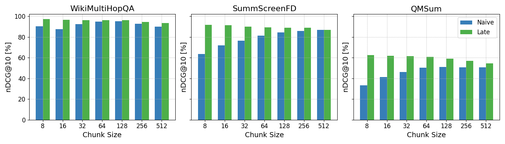
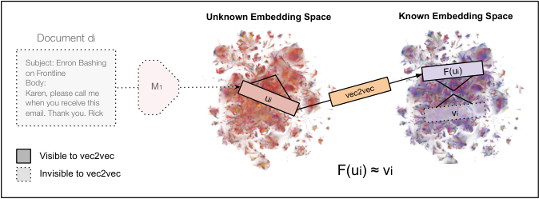
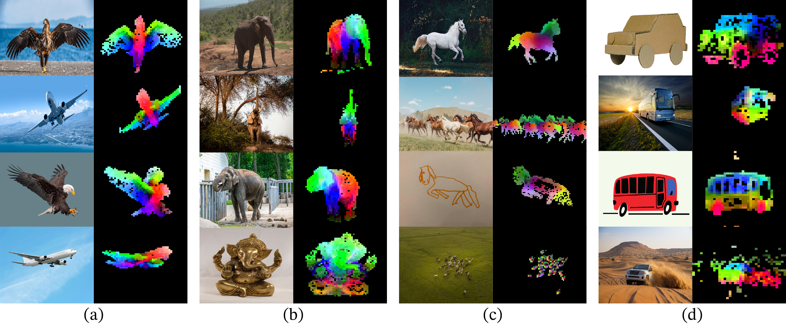
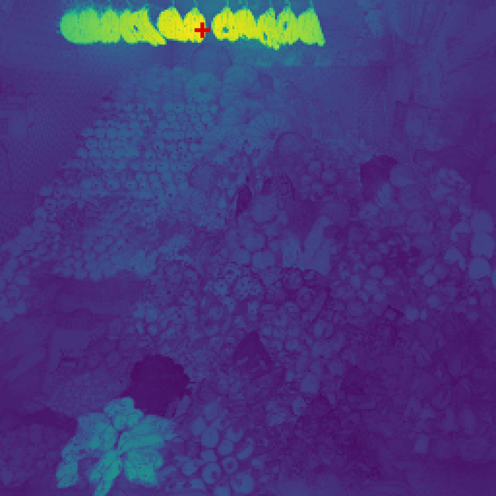
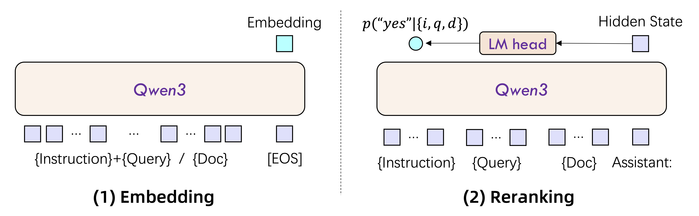
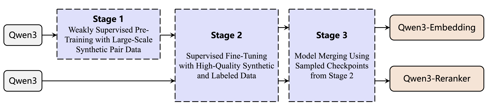
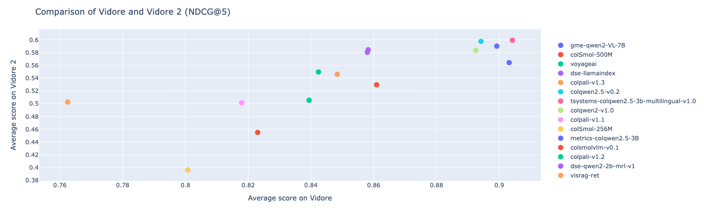
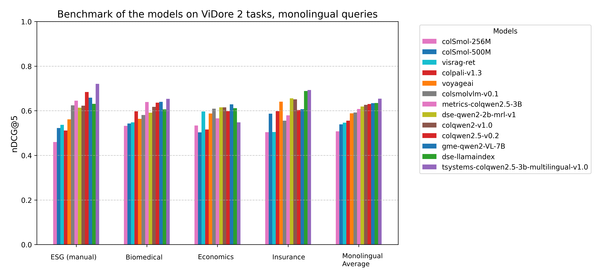

# 前沿短深读集合：Late Chunking / Vec2Vec / ModernBERT / DINOv2+v3 / Qwen3-Embedding / Seed1.5-Embedding / ViDoRe v2

> **paper**（按小节顺序）：[Late Chunking (Jina AI 2024)](https://arxiv.org/abs/2409.04701) · [Vec2Vec (Cornell 2025, NeurIPS 2025)](https://arxiv.org/abs/2505.12540) · [ModernBERT (Answer.AI + LightOn 2024)](https://arxiv.org/abs/2412.13663) · [DINOv2 (Meta 2023, TMLR 2024)](https://arxiv.org/abs/2304.07193) · [DINOv3 (Meta 2025)](https://arxiv.org/abs/2508.10104) · [Qwen3-Embedding (Alibaba 2025)](https://arxiv.org/abs/2506.05176) · [Seed1.5-Embedding (ByteDance 2025 blog)](https://seed.bytedance.com/en/blog/introducing-seed1-5-embedding) · [ViDoRe v2 (Illuin 2025)](https://arxiv.org/abs/2505.17166)
>
> **本文定位**：把 2024–2025 年**7 个方向性单点**用短深读格式一次讲清——每个 2–4k 字，专注**新点子 + 关键实验 + 与已有工作的关系**，不铺陈完整训练细节。目的：读完能判断「这些前沿是否值得进入自己的技术栈」。
>
> 本文覆盖的是主流冲榜路线**之外**的方向：分块与推理侧优化（Late Chunking）、跨模型表示对齐（Vec2Vec）、encoder 基础设施升级（ModernBERT）、纯视觉自监督（DINOv2/v3）、2025 年新一代 LLM-Emb（Qwen3、Seed1.5）、新一代视觉文档评测（ViDoRe v2）。

---

## Late Chunking：把切分放到 Transformer 之后

> **paper**：[Late Chunking: Contextual Chunk Embeddings Using Long-Context Embedding Models (Jina AI, 2024-09)](https://arxiv.org/abs/2409.04701) · [Jina 官方博客解读](https://jina.ai/news/what-late-chunking-really-is-and-what-its-not-part-ii/)
> **backbone**：任何**长上下文** embedding 模型（Jina-embeddings-v2 8K / Jina-embeddings-v3 8K / Nomic-Embed 8K / BGE-M3 8K）
> **contribution**：**免训练可用**；同时提出配套的对比训练方案（可选，进一步涨分）

### 问题：Naive chunking 的语义缺失

传统做法：把长文档切成 N 个小 chunk（512 token 或按句子/段落）→ **每个 chunk 独立走 embedding model 编码** → 存入向量库。

问题：一旦切了，chunk 里的**指代**、**上下文实体**就丢了。例：一篇 Berlin 的 Wikipedia 文章，被切成 3 chunk：

- Chunk 1：`Berlin is the capital and largest city of Germany...`
- Chunk 2：`Its more than 3.85 million inhabitants...`
- Chunk 3：`The city is also one of the states of Germany...`

Chunk 2/3 里的 "Its" / "The city" 都指向 Berlin，但**独立编码时模型不知道**，导致检索时"Berlin" query 与 chunk 2/3 的相似度显著低。

### 方法：Encode → Chunk → Pool

Late Chunking 把顺序反过来：**先 encode 整个长文档**（得到 token embedding 序列），**然后切分**，**最后各 chunk 单独 mean-pool**：

```
Naive:    [chunk1] → encoder → mean pool → emb1
          [chunk2] → encoder → mean pool → emb2
          ...

Late:     [full doc] → encoder → [tok emb 序列]
                                → split into chunks → mean pool each → emb1, emb2, ...
```


关键洞察：**Transformer 的每个 token embedding 已经吸收了整个文档的上下文**（因为 self-attention），所以在 pool 之前切分不会丢上下文——chunk 2 的每个 token 都"知道自己在讲 Berlin"。

### 关键数据

Berlin 例子的余弦相似度对比：

| Chunk 内容                                             | Naive sim | Late sim |
| ------------------------------------------------------ | :-------: | :------: |
| "Berlin is the capital and largest city of Germany..." | 0.8486   | 0.8495  |
| "Its more than 3.85 million inhabitants..."             | 0.7084   | **0.8249** |
| "The city is also one of the states of Germany..."     | 0.7535   | **0.8498** |

Naive 里 chunk 2/3 相对 chunk 1 掉 10 分，Late 全部持平。**"Its" 与 "The city" 在 Late 版里成功继承了 Berlin 的语义**。

### BEIR 消融


- **chunk_size ∈ [64, 256]** 是甜点区间：naive 效果差、late 明显涨。
- **chunk_size 到 512+**：naive 追上——因为每个 chunk 本身已经够长、上下文丢失不明显。
- **平均 nDCG@10 涨幅**：`0.53%–7.5%` 分数据集变化；HotpotQA 类多跳最受益，SciFact 类精短事实基本持平。

### 长文档扩展：Long Late Chunking

上面的做法需要文档能整体过 encoder（8K 上下文限制）。文档更长时怎么办？Jina 提出「重叠窗口 late chunking」：



- 用**滑动窗口**（例：8K 窗口，2K 步长）多次 encode。
- 每个 token 会被多个窗口 encode 到不同的 embedding。
- 对同一 token 取**中心窗口**的 embedding（离窗口边缘远的 token 上下文最全）。
- 再做 chunk 切分与 pool。

### 何时用

**推荐场景**：

- RAG 长文档索引，chunk_size = 128–256（很多 RAG 系统默认值）。
- 文档内多次指代/主语省略（法律文书、科技论文、Wiki 类）。
- 已有长上下文 embedding 模型（Jina v2/v3、Nomic、BGE-M3）。

**不推荐**：

- chunk 已经很长（> 512）→ 收益微。
- 短查询 → 短 chunk 的 STS 类任务（naive 就够）。
- 不支持 8K+ 上下文的老 embedder（BERT-base 512）。

Anthropic 2024 也发过 [Contextual Retrieval](https://www.anthropic.com/news/contextual-retrieval)，思路类似（用 LLM 为每个 chunk 生成上下文描述再嵌入）。**Late Chunking 是"免训练"版本**，Contextual Retrieval 是"LLM 增强版"，两者不冲突可以叠加。

---

## Vec2Vec：跨模型表示无监督对齐

> **paper**：[Harnessing the Universal Geometry of Embeddings (NeurIPS 2025)](https://arxiv.org/abs/2505.12540)
> **code**：[rjha18/vec2vec](https://github.com/rjha18/vec2vec)（Cornell）
> **contribution**：**首个无 paired 数据的 embedding 空间翻译方法**——用 GAN + cycle consistency 学出「跨模型的通用潜空间」

### 问题：换 embedding 模型 = 重建索引

想象一个场景：向量库存了 1 亿条 doc 的 BGE-large 向量；现在想换成 NV-Embed-v2。**只能重跑 1 亿次 forward 重建索引**——每次换 embedder 都是这种代价。

Vec2Vec 想问：**可不可以只有向量、没有原文档，就把「A 模型的向量」翻译成「B 模型的向量」？**

理论根据：**Strong Platonic Representation Hypothesis**（作者提出的强化版）——不同 encoder 训在同一模态（文本）上，尽管架构、数据、参数量不同，最终 embedding 空间**收敛到同一潜在几何**。因此存在一个**通用潜空间**，各家 embedder 的向量都能翻译进出。

### 方法：GAN + Cycle Consistency


给定两组**没有配对**的 embedding：$\{u_i\} = M_1(D_1)$（未知 encoder A 编码文档集 $D_1$）和 $\{v_j\} = M_2(D_2)$（已知 encoder B 编码文档集 $D_2$）。**$D_1 \cap D_2 = \emptyset$**——两组文档完全不同。

Vec2Vec 学两个 adapter：

- $A_1: \text{Space}_1 \rightarrow \mathcal{T}$（把 M1 空间投到共享潜空间 $\mathcal{T}$）
- $B_1: \text{Space}_2 \rightarrow \mathcal{T}$
- $A_2: \mathcal{T} \rightarrow \text{Space}_1$
- $B_2: \mathcal{T} \rightarrow \text{Space}_2$

用三个损失联合训练：

1. **Adversarial loss**：GAN 判别器让 $A_1(u)$ 和 $B_1(v)$ 在 $\mathcal{T}$ 中**分布不可区分**。
2. **Cycle consistency**：$A_2(A_1(u)) \approx u$ 且 $B_2(B_1(v)) \approx v$（翻译回来要不变）。
3. **Vector space preservation**：$A_1(u_1) - A_1(u_2)$ 与 $u_1 - u_2$ 的关系保持。

推理：给一个未知 M1 生成的向量 $u$，用 $B_2(A_1(u))$ 就能得到 M2 空间下的等价向量。

### 关键结果



作者跨 5 个 embedder 模型对（GTR-T5 / GTE-base 等）验证：

- **翻译向量与真实 B 模型向量的余弦相似度**：**高至 0.96**。
- **8000+ shuffled embeddings 的匹配准确率**：**几乎 100%**（模型能"猜出"每个向量翻译过来对应哪一个）。


上图论文 Figure 4：**对角线（同一文档在两个模型下的翻译对应）明显更亮**——翻译不是随机映射，而是恢复了真正的语义匹配。

### 安全含义（论文主要卖点）

Vec2Vec 的一个直接后果是**向量数据库不再安全**：

- 攻击者拿到未知 embedder 的向量库 dump。
- 用一批公开文档跑自己已知 encoder 得到 $\{v_j\}$。
- Vec2Vec 训一个从未知空间到已知空间的翻译。
- **翻译后可以用 [Text Embedding Inversion](https://arxiv.org/abs/2310.06816) 等技术反推原文档**。

论文实测反推的 Enron email dataset：**成功恢复关键实体（人名、邮件主题）**。这告诉工业界：**向量库要像加密数据库一样保护，不能只当作"无法反推的哈希"**。

### 对 embedding 工程的启示

正向用法：

- **换模型不重建索引**：训一个 Vec2Vec 把老向量库翻译到新模型空间。
- **多模型 ensemble**：把不同 embedder 的向量投到共享潜空间做投票。
- **私有 embedder 到公有 API 的迁移**（合规/成本考虑）。

反向警示：

- **不要把 embedding 当加密向量存储**。
- **想不泄露语义，只能不存 embedding**——或者加同态噪声（[HE-Embedding](https://arxiv.org/abs/2306.07946) 系工作）。

---

## ModernBERT：新一代 BERT 基础设施

> **paper**：[Smarter, Better, Faster, Longer: A Modern Bidirectional Encoder (2024-12)](https://arxiv.org/abs/2412.13663)
> **code / weights**：[HuggingFace/answerdotai/ModernBERT](https://huggingface.co/answerdotai/ModernBERT-base) · [answerdotai/ModernBERT](https://github.com/AnswerDotAI/ModernBERT)
> **backbone**：**ModernBERT-base 149M** / **ModernBERT-large 395M**
> **contribution**：**BERT 骨干 6 年首次 Pareto 改进**——2T token 预训练、8K 原生上下文、RoPE + FlashAttention + Alternating Attention

### 问题：BERT 已经 6 年没升级

BERT (2018) 的架构组合：**512 上下文 + Absolute Position + 常规 self-attention + WordPiece 30k vocab**。到 2024 年这些每一项都过时了：

- **512 上下文**太短，长文档要截断。
- **Absolute position** 无法外推到未训练长度。
- **常规 attention** 慢；FlashAttention / SwiGLU / GLU 已成 LLM 标配。
- **WordPiece 30k** 词表小，多语差。

BERT 依然是生产 embedding 的主力骨干（bge-large / e5-base / gte-large / SBERT），需要「工业升级版」。

### 方法：把 LLM 领域的现代技术套回 encoder

ModernBERT 引入的现代技术组合：

| 组件            | 原 BERT           | ModernBERT                                    |
| --------------- | ----------------- | --------------------------------------------- |
| Position enc.   | Absolute (learned)| **RoPE**（旋转位置编码）                       |
| Attention 实现  | 常规 self-attn    | **FlashAttention 2**                          |
| 注意力模式      | 全局              | **Alternating**（层间交替 global / local 3:1）|
| Activation      | GELU              | **GeGLU**（Gated GeLU Linear Unit）          |
| Norm            | LayerNorm         | **RMSNorm**（更简单更稳定）                    |
| Vocab           | 30k WordPiece    | **50k BPE**（多语更好）                        |
| 最大上下文     | 512              | **8192 原生**                                 |
| 预训练量        | 3.3B token        | **2 T token**                                 |
| 训练数据        | Wiki + Books      | 混合 web / code / academic                    |
| Dropout         | 0.1              | **0**（现代化 - fully saturated）             |

**Alternating Attention**：论文最工程化的一点——每 3 层「local attention」（128 token 窗口）+ 1 层「global attention」。这让长序列计算量从 $O(L^2)$ 大幅降到 $O(L \cdot W)$（$W=128$），但通过每 4 层的 global attention 保证信息全局流动。

### 关键实验

- **GLUE Avg**：ModernBERT-base **88.4**（vs BERT-base 79.6, DeBERTa-v3-base 89.0）——大幅追上 DeBERTa。
- **BEIR Retrieval (fine-tuned)**：ModernBERT-large **56.4**（vs BERT-large 55.2, DeBERTa-v3-large 55.0）。
- **Long context (2K–8K)**：base 版**推理吞吐 4× 于 BERT-base**（FlashAttention + Alternating）。
- **Code embedding**（CodeSearchNet）：ModernBERT-base **85.8**（vs BERT 78.3）。

### 对 embedding 的意义

ModernBERT 是 **BGE / E5 / GTE 系嵌入模型的下一代 base**——训 embedder 时替换 BERT-base 骨干即可获得：

1. **8K 上下文原生**：无需长上下文微调（Jina 系 v2/v3 曾在这上面花大力气）；
2. **推理速度 4×**：8K 序列下延迟大幅降；
3. **同参数量下 GLUE / BEIR 分数提升 1–3 点**。

发布后已被 [nomic-embed-v2](https://huggingface.co/nomic-ai/nomic-embed-text-v2-moe) / [ModernBERT-Embed](https://huggingface.co/nomic-ai/modernbert-embed-base) 采用；预计 2025 后半年 BGE-v3 / mE5-v2 也会切换。

### 何时用

- **新训 BERT 系嵌入模型**：默认选 ModernBERT 而非原 BERT。
- **需要 8K 上下文**：ModernBERT 原生支持，不用外推 warm-up。
- **短文本单语英文**：BERT 骨干精度更高（DeBERTa-v3-base 88.6 vs ModernBERT-base 88.4），但速度慢。
- **多语场景**：ModernBERT vocab 50k 覆盖有限，还是要 XLM-R / Gemma-2 系。

---

## DINOv2 / DINOv3：纯视觉自监督

> **paper**：[DINOv2 (TMLR 2024)](https://arxiv.org/abs/2304.07193) · [DINOv3 (2025-08)](https://arxiv.org/abs/2508.10104)
> **code / weights**：[facebookresearch/dinov2](https://github.com/facebookresearch/dinov2) · [facebookresearch/dinov3](https://github.com/facebookresearch/dinov3)
> **backbone**：DINOv2 ViT-g/14 1.1B；**DINOv3 ViT-7B / -H / -L / -S**
> **contribution**：DINOv2 = 学 CLIP 之外**纯视觉自监督** 的 SOTA；DINOv3 = **数据 curation + Gram anchoring + 后训适配**

### DINOv2：无监督视觉基础模型

**Motivation**：CLIP 系视觉塔适合**图文对齐 / zero-shot 分类**，但在**密集预测**（分割、深度、点匹配）上不如 iBOT / DINO 系自监督。DINOv2 想拿到**"跨图文与密集两条腿"** 的表示。

**核心技术**：

1. **数据 curation pipeline**：从 unlabeled 图库中，用现有 embedding 模型做**去重 + 类平衡采样**，得到 142M "LVD-142M" 数据集（相对 LAION-5B 缩小 30× 但 curated）。


2. **多目标训练**：同一 ViT 骨干下同时训：
   - **DINO loss**（image-level self-distillation）：teacher (EMA) 与 student 对 global crop 的 CLS 表示对齐。
   - **iBOT loss**（patch-level self-distillation）：随机 mask 部分 patch，让 student 的 patch feature 匹配 teacher 完整图的 patch feature。
   - **KoLeo regularizer**：让 batch 内 feature 均匀分布（Kozachenko-Leonenko）。
   - **SwAV** 的 prototype 分配。

3. **蒸馏**：训一个 1.1B ViT-g/14 大模型，再蒸馏到 ViT-L / ViT-B / ViT-S 小尺寸。

**关键结果**：



DINOv2 在**大多数 image-level 与 pixel-level 基准上超过 OpenCLIP**（同参数量），尤其是：

- **深度估计**：明显优于 CLIP。
- **点匹配 / semantic correspondence**：显著胜。
- **物体检测**：分割任务上 DINOv2 patch 特征更好。
- **图文对齐（zero-shot 分类）**：稍逊 CLIP（因为它没训图文对）。

**DINOv2 的三个用武之地**：

1. **图搜图**（instance retrieval）：用 DINOv2 patch avg 或 CLS 都比 CLIP 好。
2. **密集预测头 backbone**：分割、深度、光流。
3. **VLM 视觉塔的补充**：SigLIP 2 在 20% 训练阶段加入 DINO-style 自蒸馏就是学 DINOv2。

### DINOv3：Gram Anchoring 解决长训退化

**Motivation**：DINOv2 训久了会遇到「**dense feature 退化**」——训练继续，image-level 分数继续涨，但 patch-level feature 变糙（分割等任务掉分）。DINOv3 主要贡献是解决这个。

**Gram Anchoring**：

$$
\mathcal{L}_{\text{gram}} = \bigl\| G(F_{\text{student}}) - G(F_{\text{teacher}}) \bigr\|_2^2
$$

其中 $G(F) = F F^\top / \|F\|^2$ 是 **Gram matrix**（patch pairwise similarity 矩阵）。让 student 和 teacher 的 patch **相对结构**保持一致，而不是要求单个 patch 精确匹配。


对比图（论文 Figure 10）：**加了 Gram anchoring 后，长训后期 patch feature 依然精细**——同一区域的所有 patch 相似度保持稳定，而无 Gram 版本退化成噪声。

**其它 DINOv3 改进**：

- **Careful data curation**：进一步优化 LVD 数据集，共 1.6B 图。
- **7B ViT + 蒸馏系列**：H / L / S / satellite 变体。
- **Post-hoc alignment**：训完 SSL 后，可选做**文本对齐**（弱监督 image-text 对），让 DINOv3 同时能做 zero-shot 分类。
- **高分辨率支持**：从 224 → 512 → 768 分辨率分级 fine-tune。



**关键结果**：DINOv3-7B 在几乎所有密集视觉任务上超过 DINOv2-g/14；同时通过 post-hoc alignment 追平 SigLIP 2 的 zero-shot 分类分数。**首次在同一模型上做到"密集特征 SOTA + zero-shot 分类竞争力"**。

### DINO 系与 embedding 的关系

- **图搜图 embedder**：DINOv2 / DINOv3 的 CLS 或 patch avg 是主流选择（Nomic-Embed-Vision 等直接用 DINOv2）。
- **多模态嵌入的补充**：SigLIP 2 在 20% 训练时加 DINO-style 自蒸馏就是为了拿到 DINOv2-level 的密集特征；BGE-VL / MegaPairs 挖 image pair 时用 DINOv2 做 visual-pattern 相似度。
- **视觉塔 in VLM**：Qwen2-VL / InternVL 的部分变体在视觉塔上做 DINOv2 混合初始化。

---

## Qwen3-Embedding：2025 年新一代 LLM-Emb

> **paper**：[Qwen3 Embedding (Technical Report, 2025-06)](https://arxiv.org/abs/2506.05176)
> **code / weights**：[QwenLM/Qwen3-Embedding](https://github.com/QwenLM/Qwen3-Embedding) · [Qwen/Qwen3-Embedding-0.6B/4B/8B](https://huggingface.co/collections/Qwen/qwen3-embedding-6839e5b1ce4a1e2c8f5c5c8f)
> **backbone**：**Qwen3-0.6B / 4B / 8B**（三档，同时释放 embedder 和 reranker）
> **contribution**：**GTE-Qwen 系的升级版**，Qwen3 LLM 作骨干 + 数据合成 + 模型合并策略；MTEB 多语最强开源

### 定位

Qwen3-Embedding 是**Alibaba GTE-Qwen 系列的下一代**：

- 从 gte-Qwen1.5B/7B → gte-Qwen2-1.5B/7B → **Qwen3-Embedding-0.6B/4B/8B**。
- 核心变化：换 **Qwen3** 骨干（Qwen 系最新一代 LLM）+ 三档模型规格 + 更精细的数据合成 + **模型合并（Model Merging）**。

### 架构



- 骨干：Qwen3-{0.6B/4B/8B}，**causal attention 保留**（同 BGE-EN-ICL 路线）。
- Pooling：**last token EOS**。
- 指令：query 侧加，doc 无。
- 相似度：cosine。

Embedding + Reranker 用**同一骨干**：Reranker 输入 `A: {q} B: {p}`，输出 "Yes"/"No" 二元 logit——与 BGE-Reranker v2.5 完全同架构。

### 训练流水线



**Stage 1：Weakly Supervised Pretraining**（大规模弱对）

- 从 Web 抓的 (title, body) / (Q, A) / bitext 等
- **Qwen3 LLM 参与数据合成**：给 LLM 一个种子 doc，让它生成同义 query 或反事实 hard neg。
- 200M+ 弱对，覆盖 100+ 语。

**Stage 2：Supervised Fine-tuning**

- 混合 Retrieval / Classification / Clustering / STS / Reranking 数据。
- 温度 InfoNCE + hard neg + in-batch。
- Instruction template（**Qwen3-Embedding 用了 100+ 条不同 instruction**，比 E5-Mistral 的 500k 更多样）。

**Stage 3：Model Merging（模型合并）**

- 在 Stage 2 里训**多个特化模型**（Retrieval-focused、Classification-focused、STS-focused …），然后**做参数级平均**（Model Soup）。
- 好处：**规避多任务 zigzag 更新**——每个特化模型都在自己域上收敛好，再合并成一个通用模型。
- 缺点：训练成本大——要跑 N 遍。

### 关键结果

在 MTEB v2（更新版）上：

| 模型                       | Params | MTEB Multi | MTEB EN | 备注                    |
| -------------------------- | :----: | :--------: | :-----: | ----------------------- |
| Qwen3-Embedding-0.6B        | 0.6B   | 64.3       | 68.5    | **0.6B 最强开源**       |
| Qwen3-Embedding-4B          | 4B     | 68.7       | 71.4    | Pareto 甜点             |
| **Qwen3-Embedding-8B**     | 8B     | **70.6**   | **73.1** | **多语 MTEB SOTA 2025** |
| bge-multilingual-gemma2    | 9B     | 68.9       | 69.9    | 上一代多语最强          |
| NV-Embed-v2                | 7.85B  | –          | 72.3    | 英文单语最强             |

**核心亮点**：

- **0.6B 模型达到 64+ 分**——比 SFR-Embedding-Mistral（7B）还高。这是**极小 LLM-Emb 的性价比标杆**。
- **8B 版是多语最强开源**（MTEB Multilingual 70.6）。
- 同时释放 embedder 和配套 reranker，**训练配方公开**（Apache 2.0）。

### 与 BGE-EN-ICL / bge-multilingual-gemma2 的差别

| 维度         | BGE-EN-ICL                | bge-multilingual-gemma2 | **Qwen3-Embedding**              |
| ------------ | ------------------------- | ----------------------- | -------------------------------- |
| Backbone     | Mistral-7B                | Gemma-2-9B              | **Qwen3-{0.6/4/8B}**             |
| ICL 训练     | ✓（示例 in-batch）        | ✗                        | ✗（future work）                  |
| 多语         | 弱                        | ✓                        | **✓ 且中文最强**                  |
| 模型规格     | 1 档 7B                   | 1 档 9B                  | **3 档 0.6/4/8B**                |
| 数据合成     | 手工 + 少量 LLM 合成      | 手工                    | **大量 LLM 合成**                 |
| Model Merging | ✗                         | ✗                        | ✓（3 阶段核心）                   |

Qwen3-Embedding 的**多规格 + LLM 合成 + Model Merging** 组合是 2025 年 embedder 发布的新标配。

---

## Seed1.5-Embedding：字节的 LLM-Emb

> **blog**：[Introducing Seed1.5-Embedding (ByteDance Seed, 2025-04)](https://seed.bytedance.com/en/blog/introducing-seed1-5-embedding)
> **model**：闭源；通过 Seed 平台 API 提供
> **backbone**：Seed1.5-7B（字节自家 LLM）
> **contribution**：MTEB v2 上短暂占据榜首（**73.7**）；证明"顶级 LLM 直接做 embedder"的天花板

### 要点

Seed1.5-Embedding 没发 arXiv 论文，只有 blog + 模型 API：

- **backbone**：Seed1.5-7B——ByteDance 自家 LLM。
- **训练框架**：与 NV-Embed / GritLM 类似，但细节未公开。
- **数据**：大规模内部数据 + LLM 合成，具体量级未披露。
- **关键成绩**：**MTEB v2 平均 73.7**（NV-Embed-v2 是 72.3，Qwen3-Embedding-8B 是 70.6）。

**方法学意义**：

- 证明「越好的 LLM 骨干 → 越好的 embedder」这条 scaling law 在 7B 规模仍然成立。
- 内部 LLM 与顶级开源 LLM（Mistral / Qwen / Gemma）的差距**能直接反映到 embedder 分数上**。
- **闭源 embedder 的 SOTA 参考线**：Cohere embed-v4、Voyage-3.5、OpenAI text-embedding-3-large、Seed1.5-Embedding。

### 缺点与限制

- **权重、训练代码、数据未公开**：无法复现或本地部署，只能通过火山引擎 API 访问。
- **训练配方未 disclose**：从 blog 描述看没有本质架构创新（应用了业界公认的双向 attention + 指令 + hard neg + 蒸馏），主要靠**更强 backbone + 更大数据**。
- **主要为字节内部业务优化**：抖音搜索、内部 RAG 等场景。第三方评估集上分数强，但生产选型上要考虑 API 成本、隐私、SLA。

### 何时选用

- 需要 **API 化的中英文顶级 embedder**（内部业务、无法自部署 LLM）。
- 有火山引擎生态 / 已用其它 Seed 系模型（LLM、语音等）。
- 对分数敏感、可以接受闭源。

**不选用**：

- 需要本地部署 / 数据合规敏感。
- 需要复现或改造训练配方。
- 中英外语言场景（Qwen3-Embedding-8B / bge-multilingual-gemma2 更均衡）。

---

## ViDoRe v2：视觉文档检索的新一代基准

> **paper**：[ViDoRe Benchmark V2 (2025-03)](https://arxiv.org/abs/2505.17166) · [官方 blog](https://huggingface.co/blog/manu/vidore-v2) · [leaderboard](https://huggingface.co/spaces/vidore/vidore-leaderboard)
> **contribution**：**ViDoRe v1 已饱和**（top 模型 nDCG@5 > 90），v2 提高难度评估视觉文档检索

### 问题：v1 太简单了

ViDoRe v1（[Faysse 2024](https://arxiv.org/abs/2407.01449)）2024 年发布，与 ColPali 一起用来评价视觉文档检索。到 2025 年头部模型已经把 v1 nDCG@5 推到 **90+**——**评测已经饱和**，无法区分模型。

关键问题：

1. **Query 太提取式**：v1 的 query 直接是文档里的短语（"What is the interest rate?"）——不符合真实用户"半自然半模糊"的问法。
2. **Single-page bias**：大部分 query 只需要一页就能答，不测跨页推理。
3. **Language coverage 有限**：v1 主要英文 + 少量法文。

### ViDoRe v2 的三个新设计



上图显示 SOTA 模型在 v1 上都 90+，v2 上大幅分化（60–85），**恢复了区分度**。

**设计 1：Blind Contextual Querying**

生成 query 时给 LLM 看**上下文摘要**（不看具体页），让它写"用户会怎么问"——避免抄页面短语，query 更自然。

**设计 2：Long Contextual & Cross-Document Queries**

- **Long context**：query 需要在文档里找**多页**的信息才能答。
- **Cross-document**：某些 query 跨多个文档聚合（例："对比 X 公司 2022 与 2023 的 EBITDA 增长率"）。



**设计 3：Hybrid Human-in-the-Loop 生成**

- 先 LLM 生成 candidate query。
- 人工审核：改词 / 拒 / 补充；**每对 (query, page) 至少 2 人独立标**。
- 保证：query 措辞自然 + 答案是那一页（或多页）。


### 数据集组成

**4 个新数据集**，多语言：

1. **CorpBench-EN**：企业年报、说明书、财报，英文，长文档（多页 answer）。
2. **CorpBench-FR**：同上，法文。
3. **Encyclopedia-EN**：百科全书页，含图表 / 表格 / 抽象概念。
4. **AcademicPapers**：学术论文页，跨文档 query。

每集约 100–200 页 doc + 100+ query。**总量比 v1 小**（v1 是 10 个 domain × 1000+ page），但 **query 复杂度高得多**——一个 v2 query 可以顶 v1 的 10 个。

### 主要发现

作者在 v2 上评了主流模型：

- **顶级 SOTA vidore-ranker + ColQwen2.5-v0.1**：v2 nDCG@5 约 **77**（v1 是 91）。
- **ColPali**：v2 约 62（v1 是 81）。
- **Single-vector MLLM-embedder（GME-Qwen2-VL）**：v2 约 66（v1 上比 ColPali 好；v2 上略低——**多向量在复杂 query 上更强**）。
- **CLIP + text embedder（bge-large）+ OCR pipeline**：v2 约 30——**OCR 系全面崩**。

### 对视觉文档嵌入的启示

1. **v2 上 late interaction 依然领先**：ColPali / ColQwen 的多向量 + MaxSim 在跨页 / 长 context / 复杂 query 上比单向量强 5-10 nDCG。
2. **MLLM-based single-vector（GME）也可用**：轻量场景选它，索引小。
3. **OCR pipeline 已经不适合复杂视觉检索**：直接 vision 输入是主流方向。
4. **v2 是 living benchmark**：作者邀请社区继续贡献数据集，避免再次饱和。

生产端建议：

- **法律 / 财报 / 说明书类文档 RAG**：ColPali / ColQwen 系（配套 vidore-ranker）。
- **一般图文文档检索**：GME-Qwen2-VL 系。
- **评测选型**：**ViDoRe v2 是当前视觉文档检索的事实评测**，请以 v2 数字做判断，不要看 v1。

---

## 总览与选型建议

七个前沿工作对应七种不同问题空间：

| 方向             | 前沿工作             | 何时值得读                              |
| ---------------- | -------------------- | --------------------------------------- |
| **分块工程**     | Late Chunking        | RAG 索引长文档、避免上下文丢失          |
| **跨模型对齐**   | Vec2Vec              | 换 embedder / 向量库安全评估            |
| **Encoder 骨干** | ModernBERT           | 新训 BERT 系嵌入模型（BGE / E5 下一代）  |
| **视觉自监督**   | DINOv2 / DINOv3      | 图搜图 / 密集视觉任务 / VLM 视觉塔       |
| **LLM-Emb 前沿** | Qwen3-Embedding      | 多语 + 三档规格 + 开源                   |
| **闭源 SOTA**    | Seed1.5-Embedding    | API 化中英文顶级 embedder               |
| **视觉文档评测** | ViDoRe v2            | 复杂视觉文档 RAG 的评测                 |

## 与本仓库既有报告的挂接

- **Late Chunking** ↔ [Jina-embeddings-v3 详解](Jina/v3/Jina-embeddings-v3详解.md) · [BGE-M3 详解](BGE/M3/BGE-M3三功能统一详解报告.md)（都是长上下文 embedder）
- **Vec2Vec** ↔ [对比学习与 InfoNCE 精讲](对比学习与InfoNCE精讲.md)（GAN + cycle consistency 是对比学习的对偶思路）
- **ModernBERT** ↔ [BGE-CPack 详解](BGE/C-Pack/BGE-CPack详解.md) · [E5 详解](E5/E5详解.md)（下一代 BERT 系嵌入骨干）
- **DINOv2 / DINOv3** ↔ [CLIP 详解](CLIP/CLIP详解.md) · [SigLIP 与 SigLIP 2 详解](SigLIP/SigLIP与SigLIP2详解.md)（SigLIP 2 用 DINO-style 自蒸馏）· [0.6B 图搜图文搜图自训学习行动路线](0.6B图搜图文搜图自训学习行动路线.md)
- **Qwen3-Embedding** ↔ [GTE 系列详解](GTE/GTE系列详解.md)（gte-Qwen2 前身）· [LLM-Embedding 冲榜路线](LLM-Embedding冲榜路线_E5Mistral-NVEmbed-GritLM-SFR-Arctic-Stella.md)
- **Seed1.5-Embedding** ↔ [LLM-Embedding 冲榜路线](LLM-Embedding冲榜路线_E5Mistral-NVEmbed-GritLM-SFR-Arctic-Stella.md)
- **ViDoRe v2** ↔ [ColPali 详解](ColPali/ColPali详解.md) · [ColQwen 系列详解](ColQwen/ColQwen系列详解.md) · [MLLM 通用多模态嵌入](MLLM通用多模态嵌入_GME-VLM2Vec-BGEVL.md)
- 主文：[Embedding 调研报告](Embedding调研报告.md) §12「向量数据库与部署」、§13「前沿与开放问题」

---

*本报告基于 7 篇 arXiv 论文 + Seed1.5 blog 与官方开源材料整理。图片取自各原论文的 arXiv HTML 或 PDF。分数为 2024-09 到 2025-08 期间的公开数据。前沿方向持续演进，具体选型请查最新 leaderboard。*
