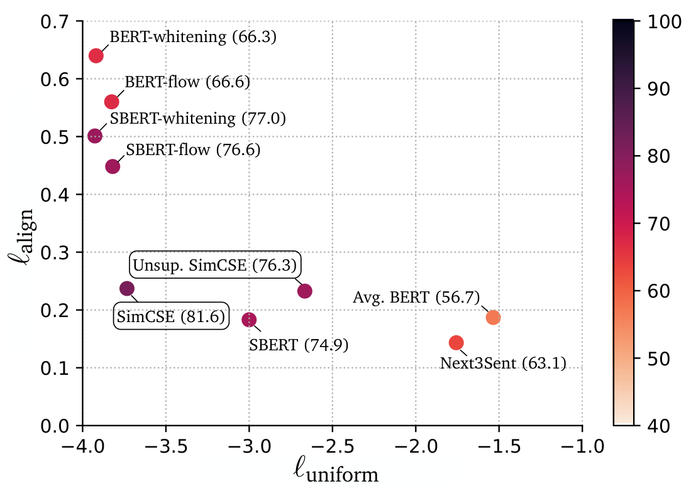
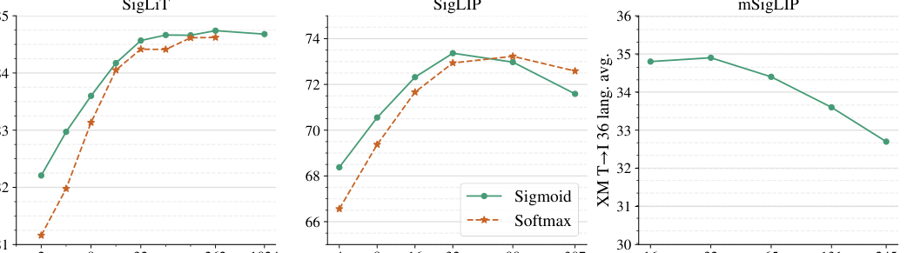

# 对比学习与 InfoNCE 精讲：SimCSE → E5 → CLIP → SigLIP 的损失演化

> **paper（按出现顺序）**：[InfoNCE / CPC (Oord 2018)](https://arxiv.org/abs/1807.03748) · [N-pair loss (Sohn 2016)](https://papers.nips.cc/paper/2016/hash/6b180037abbebea991d8b1232f8a8ca9-Abstract.html) · [Multiple Negatives Ranking Loss (Henderson 2017)](https://arxiv.org/abs/1705.00652) · [Triplet loss (FaceNet 2015)](https://arxiv.org/abs/1503.03832) · [Alignment & Uniformity (Wang & Isola 2020)](https://arxiv.org/abs/2005.10242) · [MoCo (He 2019)](https://arxiv.org/abs/1911.05722) · [SimCLR (Chen 2020)](https://arxiv.org/abs/2002.05709) · [SimCSE (Gao 2021)](https://arxiv.org/abs/2104.08821) · [DPR (Karpukhin 2020)](https://arxiv.org/abs/2004.04906) · [CLIP (Radford 2021)](https://arxiv.org/abs/2103.00020) · [SigLIP (Zhai 2023)](https://arxiv.org/abs/2303.15343) · [Margin MSE / TAS-B (Hofstätter 2020)](https://arxiv.org/abs/2010.02666) · [CoSENT (苏剑林 2022)](https://kexue.fm/archives/8847) · [BGE-M3 (Chen 2024)](https://arxiv.org/abs/2402.03216) · [GritLM (Muennighoff 2024)](https://arxiv.org/abs/2402.09906) · [Vec2Vec (2025)](https://arxiv.org/abs/2505.12540)
>
> **本文定位**：把「向量检索/嵌入」用的损失函数按**信号演化路径**一次讲透 —— 从 CPC 定义 InfoNCE，到 SBERT/SimCSE 把它落到句向量，到 CLIP 跨模态对称化，到 SigLIP 把 softmax 换成 sigmoid，到 BGE-M3 把 dense/sparse/multi-vec 三头拼接、Conan/RocketQA 把 CE 蒸馏到 BE。每一段都写清楚**动机 → 数学式 → 什么时候会崩 → 后续如何被替代**。
>
> **配套**：机制层面的模型深读在同目录的《[无监督对比检索三部曲：SimCSE / Contriever / Condenser+coCondenser](无监督对比检索三部曲_SimCSE-Contriever-Condenser.md)》《[CLIP 详解](CLIP详解.md)》《[SigLIP 与 SigLIP 2 详解](SigLIP与SigLIP2详解.md)》《[E5 详解](E5详解.md)》《[BGE-M3 三功能统一详解报告](BGE-M3三功能统一详解报告.md)》。

---

## 一句话定位

嵌入模型 90% 的性能差异来自**训练损失 + 负例配方**，而不是骨干或数据规模。**InfoNCE 是当下 embedding 家族的公理**：它把「拉近正对、推开负对」写成一个可微、跨 batch 可实现的形式。所有后续变体——SimCSE / DPR / CLIP / SigLIP / BGE-M3 / Conan-CBB / GritLM——都是在下面这几个坐标上做取舍：

1. **正对怎么来**（数据/增强/挖掘）
2. **负对怎么来**（in-batch / MoCo queue / ANN hard neg / cross-GPU）
3. **归一方式**（softmax vs sigmoid vs margin）
4. **对称还是非对称**（q/d 是否共享编码器、是否共享指令）
5. **附加信号**（KL 蒸馏、Margin MSE、alignment 正则）

搞清这五条，才能在具体项目里判断「换个 loss 会不会掉、加不加 hard neg、用不用蒸馏」。

## 谱系导览

```text
Metric learning 起源
├── Contrastive loss (Hadsell 2006)：pair-based margin
├── Triplet loss (FaceNet 2015)：anchor / pos / neg
├── N-pair loss (Sohn 2016)：一个正 + N-1 个负 + softmax   ← InfoNCE 前身
│
InfoNCE / CPC (Oord 2018) —— 视觉自监督 + 语言表示的共同源头
├── 视觉自监督：SimCLR / MoCo / BYOL / DINO
├── 双塔检索：DPR / SBERT / ANCE / RocketQA
├── 句向量：SimCSE (dropout as noise) / Contriever
├── 图文双塔：CLIP → ALIGN → OpenCLIP → SigLIP → SigLIP 2
├── 蒸馏系：TAS-B (Margin MSE) / RocketQAv2 (soft-label CE) / Jasper
├── 组合系：BGE-M3 (Dense+Sparse+ColBERT) / Conan-CBB / GritLM (Gen+Rep)
└── 前沿：Late Chunking / Vec2Vec / 2D-Matryoshka
```

后文按上面这条路径逐个展开。

---

## Metric learning 起源：contrastive / triplet 为什么最后不流行

### Pair-based contrastive loss（Hadsell 2006）

给一对样本 $(x_1, x_2)$，标签 $y \in \{0, 1\}$（1 表示同类）：

$$
\mathcal{L} = y \cdot d(x_1, x_2)^2 + (1-y)\cdot \max\bigl(0, m - d(x_1, x_2)\bigr)^2
$$

- $d$ 通常是欧氏或余弦距离，$m$ 是 margin。
- 直觉：同类越近越好，异类保持至少 $m$ 的距离。

**问题**：一次前向只能看 1 对样本、只利用 1 个信号；训练效率极低，且 margin 是超参不易调。

### Triplet loss（FaceNet 2015）

给 (anchor, positive, negative) 三元组：

$$
\mathcal{L} = \max\bigl(0, \;\|f(a) - f(p)\|^2 - \|f(a) - f(n)\|^2 + m\bigr)
$$

- 每步至少一个正对 + 一个负对，比 pair 强一倍。
- FaceNet 用这个训人脸识别，取得 SOTA。

**问题**：

1. **负例挖掘困难**：随机负太易（loss 恒为 0），全 hard 又抖动。需要「semi-hard mining」的复杂流程。
2. **信号密度低**：一次前向只用了 3 个样本；同 batch 的其他信息没用上。
3. **margin 敏感**：不同任务的 $m$ 差异大，跨任务复用难。

### N-pair loss（Sohn 2016）

Triplet 的多负例扩展：一个正对 + $N-1$ 个负对，softmax 归一：

$$
\mathcal{L} = -\log \frac{\exp(f(a)^\top f(p))}{\sum_{n=1}^{N-1} \exp(f(a)^\top f(n)) + \exp(f(a)^\top f(p))}
$$

这实质是 **softmax 交叉熵 over $N$ 个候选**——**这就是 InfoNCE 的前身**。Sohn 用这个训 deep metric learning，比 triplet 快得多。

### 为什么这条路线最终让位给 InfoNCE

Metric learning 三种损失有个共同点：**每一步只看少量样本**，需要**显式的样本对/三元组构造**，且都受 margin 调参困扰。InfoNCE 把这套形式化到「一个正对 + 一整个 batch 的负对做 softmax」，一次前向就把 $N$ 个样本全部用满，成为后来所有大规模嵌入训练的默认。

---

## InfoNCE：现代对比学习的公理

### 从 CPC 的信息论视角推导

CPC（Contrastive Predictive Coding，Oord et al. 2018）的目标是**最大化上下文表示与未来样本表示之间的互信息**。给定上下文 $c$、正样本 $x^+ \sim p(x|c)$、负样本 $\{x^-_i\} \sim p(x)$，定义打分 $f(x, c) \propto p(x|c)/p(x)$。构造分类任务「在 $\{x^+, x^-_1, \dots, x^-_{K}\}$ 里挑出 $x^+$」：

$$
\mathcal{L}_{\text{InfoNCE}} = -\log \frac{f(x^+, c)}{f(x^+, c) + \sum_{i=1}^K f(x^-_i, c)}
$$

关键推论：**最小化 $\mathcal{L}_{\text{InfoNCE}}$ ⇔ 最大化互信息的下界** $I(x; c) \geq \log K - \mathcal{L}_{\text{InfoNCE}}$。

这条推导给了对比学习一个**理论根基**：不用调 margin、不需要显式 triplet 挖掘，只要能采到「一堆负例」，训练目标就是自动的。

### 落地形式：温度 + 余弦

在 embedding 场景里，最常见的 InfoNCE 写法：

$$
\mathcal{L}_i = -\log \frac{\exp\bigl(\mathrm{sim}(h_i, h_i^+)/\tau\bigr)}{\sum_{j=1}^N \exp\bigl(\mathrm{sim}(h_i, h_j)/\tau\bigr)}
$$

- $h_i, h_i^+$：正对（如 query / positive doc、或 SimCSE 的 dropout 两次输出）；
- $h_j$：同 batch 其他样本，作为负例；
- $\mathrm{sim}$：通常是 $\cos(\cdot, \cdot)$ 或归一化后的内积；
- $\tau$：温度，控制**软化程度**。

$\tau$ 是最容易被误用的超参：

- $\tau$ 太大（例如 1.0）：softmax 变均匀分布，正对与负对的差异被抹平，**训练梯度很小、模型学不动**。
- $\tau$ 太小（例如 0.001）：正对分数被夸大到 $\gg$ 负对，logit 差异极端；一是数值不稳（fp16 溢出），二是**只对最难的负例敏感**——训练早期负例都不难，反而没梯度。
- 经验值：句向量 $\tau=0.05$；检索 $\tau=0.01$–$0.02$（正负分数差本身就大）；CLIP 用可学 $\tau$，初始化 $\log(1/0.07)$、上界 clip 到 $\log 100$。

### Wang & Isola：把 InfoNCE 拆成 alignment + uniformity

Wang & Isola 2020 证明 InfoNCE 在 $K \to \infty$ 时可分解为两项：

$$
\mathcal{L}_{\text{InfoNCE}} \;\rightarrow\; \underbrace{-\frac{1}{\tau}\mathbb{E}\bigl[f(x)^\top f(x^+)\bigr]}_{\text{alignment 项}} \;+\; \underbrace{\mathbb{E}\log \mathbb{E}\bigl[\exp\bigl(f(x)^\top f(x^-)/\tau\bigr)\bigr]}_{\text{uniformity 项}}
$$

对应两个可测度指标：

$$
\ell_{\text{align}} = \mathbb{E}_{(x, x^+)}\lVert f(x)-f(x^+)\rVert^2
\qquad
\ell_{\text{uniform}} = \log\,\mathbb{E}_{x,y}\bigl[e^{-2\lVert f(x)-f(y)\rVert^2}\bigr]
$$

$\ell_{\text{align}}$ 越小 ⇔ 正对越紧；$\ell_{\text{uniform}}$ 越小 ⇔ 表征越均匀分布在球面。



上图（SimCSE 论文 Figure 3）画的正是这个坐标系。三个诊断结论：

1. **BERT 直接出来 mean-pool** 位于「对齐还行、均匀极差」的右上区——各向异性严重、cosine 相似度普遍偏高。
2. **删词/替换** 类离散增强会**破坏对齐**（正对被扰动到不同语义），$\ell_{\text{align}}$ 变差。
3. **Dropout as noise（SimCSE）** 同时改善两个指标——是无监督对比想要的样本。

这套分析工具直接影响了后续所有句向量论文：**画不画 align-uniform 轨迹，成了「你懂不懂对比学习」的分水岭**。

### InfoNCE 的三大工程实现分歧

给一对正对，负例从哪里来？三条主流路径：

1. **In-batch negatives**：同 batch 里其它样本当负。**简单、无额外内存**，但需要 batch 足够大（1k+）。DPR / SimCSE / CLIP / SigLIP 都是这条路。
2. **MoCo queue**：维护过去若干 batch 的 key embedding；query encoder 用 SGD 更新、key encoder 用动量 EMA 更新。**小 batch 也能吃到 10 万级负例**。MoCo / Contriever / 部分 BGE 系。
3. **ANN hard mining**：训到中途 dump 一份权重，用 FAISS 挖 top-K 高分负例；下轮训用这批 hard neg 替换 in-batch neg 的一部分。ANCE / RocketQA / BGE / Conan-DHNM。

三者可以**叠加**：BGE-M3 用「大 in-batch + cross-GPU 共享 + ANN hard neg + 蒸馏」的组合拳。工程复杂度递增。

---

## 句向量三大变体：MNRL / SimCSE / SBERT-CoSENT

### Multiple Negatives Ranking Loss（MNRL）

Sentence-Transformers 生态里最常见的 loss。给 batch $\{(q_i, p_i^+)\}$，把 $p_j^+$（$j \neq i$）当作 $q_i$ 的负例：

$$
\mathcal{L}_{\text{MNRL}} = -\frac{1}{N}\sum_{i=1}^N \log \frac{\exp\bigl(s(q_i, p_i^+)/\tau\bigr)}{\sum_{j=1}^N \exp\bigl(s(q_i, p_j^+)/\tau\bigr)}
$$

- 与 InfoNCE 完全同源，只是**用 batch 里其它正对当负**，不需要专门采负样本。
- 缺点：**batch 太小时负例覆盖不足**，收敛慢。
- 加 hard neg：`MultipleNegativesRankingLoss(query, pos, neg1, neg2, ...)`，把显式 hard neg 与 in-batch 混合当负。

### SimCSE：Dropout as data augmentation

无监督版：同一句话两次前向、两次不同 dropout mask，得到 $h^{z}_i, h^{z'}_i$：

$$
\ell_i = -\log\frac{\exp\bigl(\mathrm{sim}(h^{z_i}_i, h^{z'_i}_i)/\tau\bigr)}{\sum_{j=1}^N \exp\bigl(\mathrm{sim}(h^{z_i}_i, h^{z'_j}_j)/\tau\bigr)}
$$

监督版：加上 NLI 蕴含+矛盾三元组 $(x_i, x_i^+, x_i^-)$：

$$
\ell_i = -\log \frac{\exp\bigl(\mathrm{sim}(h_i, h_i^+)/\tau\bigr)}{\sum_j \bigl[\exp\bigl(\mathrm{sim}(h_i, h_j^+)/\tau\bigr) + \exp\bigl(\mathrm{sim}(h_i, h_j^-)/\tau\bigr)\bigr]}
$$

这一步的关键设计：**矛盾对同时进分母**，等价于把它们视为 batch 里额外的 hard neg。BERT-base STS-B 从 84.9（只用 entailment）拉到 **86.2**（+1.3）。

### CoSENT：把 STS 分数排序转成 pairwise 对比

苏剑林 2022 提出的 CoSENT loss，专为 STS（有连续相似度分数的任务）设计。核心思想：**不去逼近具体分数，只保证「分数高的对相似度也高」**。给定所有对及其 label $y_{ij}$：

$$
\mathcal{L}_{\text{cos}} = \log\Bigl(1 + \sum_{y_{ij} > y_{kl}} \exp\Bigl(\frac{\cos(x_k, x_l) - \cos(x_i, x_j)}{\tau}\Bigr)\Bigr)
$$

- 对所有 label 严格高的对 $(i,j)$ 与所有 label 严格低的对 $(k,l)$，希望它们的余弦排序也一致。
- 与 MSE 的区别：**不关心绝对值，只关心排序**——对 STS 的评价指标（Spearman）天然对齐。
- Conan-embedding-v1 就是 STS 用 CoSENT + 检索用 InfoNCE 的组合。

### 三者的分工

| 任务         | 首选 loss           | 备注                                             |
| ------------ | ------------------- | ------------------------------------------------ |
| 大规模检索   | InfoNCE / MNRL      | 大 batch + hard neg + cross-GPU                  |
| 语义相似度 STS | CoSENT / MSE regression | Spearman 目标，排序驱动                          |
| 弱监督预训练 | InfoNCE + dropout as noise | SimCSE 系                                        |
| 分类/去重     | InfoNCE + 类内正 / 类间负 | Conan / gte-Qwen 都在用                          |

---

## 双塔检索：DPR → ANCE → RocketQA 的负例迭代

### DPR：in-batch 负 + 少量 BM25 hard neg

Karpukhin 2020 的 DPR 是双塔检索的开山之作。给定 $(q, p^+, \{p^-_i\})$，用 in-batch negatives + 显式挖的 BM25 hard neg：

$$
\mathcal{L}_{\text{DPR}} = -\log \frac{\exp\bigl(s(q, p^+)/\tau\bigr)}{\exp\bigl(s(q, p^+)/\tau\bigr) + \sum_{i} \exp\bigl(s(q, p^-_i)/\tau\bigr) + \sum_{j \neq i}^{\text{in-batch}} \exp\bigl(s(q_j, p^+_j)/\tau\bigr)}
$$

BM25 hard neg 是 DPR 的关键：**光靠 in-batch 负，最难的负永远碰不上**。

### ANCE：训中异步 ANN 刷新 hard neg

Xiong 2020：训到某个 checkpoint，用当前 encoder + FAISS 全库 ANN 挖 hard neg，写盘；继续训，隔一段时间再刷新。

- 好处：hard neg 与当前模型能力对齐，训到后期还有梯度。
- 坏处：全库 ANN 刷新开销大、需要一套调度。
- 后续 [ANCE 详解](ANCE详解.md) 有详细工业实现。

### RocketQA：CE 去噪 + hard neg + 数据合成

Qu 2021：ANCE 的下一步。用 cross-encoder 给 ANN 挖出来的 hard neg 打分，**把 CE 判为相关的负例剔除**（防止「假负例」），再从生成模型合成更多正对。

- 引入了「假负例治理」的工程范式。
- v2 进一步把 KD 变成 listwise loss。

见本仓库 [RocketQA 详解](RocketQA详解.md)。

### NV-Retriever：Positive-aware hard neg

Moreira 2024：观察到 ANN top-K 里有很多是「与正例相似度接近但语义仍相关」的假负例。NV-Retriever 提出：

- 挖 hard neg 时，先算 anchor 与正例的相似度 $s^+$，**再挖那些相似度**在 $[\alpha \cdot s^+, \beta \cdot s^+]$ 区间**的样本作 hard neg**（MarginPos）。
- 或者用**百分位分层**（PercPos），保证 hard neg 分布多样。

见 [NV-Retriever 详解](NV-Retriever详解.md)。

### 三者的负例挖掘对比

| 方法             | 挖掘时机           | 挖掘策略                                | 假负治理           |
| ---------------- | ------------------ | --------------------------------------- | ------------------ |
| DPR              | 训前一次           | BM25 top-100                            | 无                 |
| ANCE             | 训中异步刷新       | 当前模型 ANN top-K                      | 无                 |
| RocketQA v1      | 训中               | ANN + **CE 去噪** + 生成合成正对         | ✓（CE 判相关就丢） |
| NV-Retriever     | 训前 + 训中        | **Positive-anchored 区间挖**             | ✓（区间截断）       |
| Conan-v1 DHNM    | 训中每 100 步       | 判负例「变易」触发换池                    | 部分（相似度阈值）  |
| Conan-v2         | 训中细粒度         | 同族替换 + 相似度阈值                   | ✓                   |

难负例配方是「同一个 InfoNCE 骨架 + 不同的负例源」，可以并存也可以叠加。见综合专题 [难负例挖掘工业实践](难负例挖掘工业实践.md)。

---

## CLIP：双向对称 InfoNCE，跨模态标配

CLIP 把 InfoNCE 首次搬到图文双塔，公式与句向量 InfoNCE 一致但**做双向平均**：

$$
\mathcal{L}_{\text{img}\rightarrow\text{txt}} = -\frac{1}{N}\sum_i \log \frac{\exp\bigl(t \cdot x_i \cdot y_i\bigr)}{\sum_j \exp\bigl(t \cdot x_i \cdot y_j\bigr)}
$$

$$
\mathcal{L}_{\text{txt}\rightarrow\text{img}} = -\frac{1}{N}\sum_i \log \frac{\exp\bigl(t \cdot x_i \cdot y_i\bigr)}{\sum_j \exp\bigl(t \cdot x_j \cdot y_i\bigr)}
$$

$$
\mathcal{L}_{\text{CLIP}} = \tfrac{1}{2}\bigl(\mathcal{L}_{\text{img}\rightarrow\text{txt}} + \mathcal{L}_{\text{txt}\rightarrow\text{img}}\bigr)
$$

**双向的动机**：文本塔与图像塔梯度都能通到；只做单向的话另一侧长期缺少直接监督。

CLIP 的三处工程细节被后续所有跨模态 embedding 直接继承：

1. **L2 归一化到球面 + 内积**（等价 cosine）
2. **温度 $\tau$ 可学**，初始化 $\log(1/0.07)$，上界 clip
3. **相似度矩阵分片计算**（超大 batch 32k 才能训）

详见 [CLIP 详解](CLIP详解.md)。

### 「双向 InfoNCE」不止用于图文

- INSTRUCTOR 用双向 InfoNCE 让非对称检索的 doc 侧也能拿到梯度。
- GritLM 里生成 + 表征联合训练，表征分支同样是双向 InfoNCE。
- 后续 E5-instruct / bge-en-icl 都保留了「x → y 与 y → x 两次损失」的模板。

---

## SigLIP：Sigmoid Loss 打破 softmax 瓶颈

### 动机：softmax 的三个瓶颈

CLIP-style softmax loss 在 batch 增大时暴露三个问题：

1. **All-gather 通信量爆炸**：分母要看整行/整列，分布式必须把 $x_i$、$y_j$ 都同步到每个 device。
2. **数值稳定要减 max**：又要多一遍全 batch 扫描。
3. **单对梯度耦合到全 batch**：换个 shard 里的样本，本对的 loss 也变。

### SigLIP 改法：pairwise binary CE

对每一对 $(I_i, T_j)$ 独立做二元 logistic 回归：

$$
z_{ij} = t \cdot (x_i \cdot y_j) + b, \qquad y_{ij} = \begin{cases}+1 & i = j \\ -1 & \text{else}\end{cases}
$$

$$
\mathcal{L}_{\text{sigmoid}} = -\frac{1}{N}\sum_{i,j} \log \sigma(y_{ij} \cdot z_{ij})
$$

- $\sigma$：sigmoid。
- $t = \exp(t')$：可学温度。
- $b$：**可学偏置**，初始化为大负数（如 $-10$）以补偿类不平衡（每 batch 正 : 负 = $1 : N-1$）。

**优势**：

- **每对独立**，可 chunked、可 permute，**去掉 all-gather**。
- 显存与 batch 无关（每步只物化 $b \times b$ 块）。
- **小 batch 也训得比 softmax 好**；大 batch 上限拉到 100 万仍不炸。



上图论文 Figure 2：**batch < 16k 时 sigmoid 显著优于 softmax**；≥32k 时持平；1M 时两者饱和。这也是 SigLIP 后来被 Qwen-VL、Gemma-VLM、InternVL 选为默认视觉塔的原因——训练成本低、可扩展。

### softmax vs sigmoid 的核心差异

| 维度              | Softmax InfoNCE                            | SigLIP-style sigmoid                        |
| ----------------- | ------------------------------------------ | ------------------------------------------- |
| 归一化范围        | 整行 / 整列（全 batch）                     | 单对独立                                    |
| 分布式通信        | 需要 all-gather                            | 只需 permute / no comm                      |
| 显存              | $O(N^2)$ 完整相似度矩阵                     | $O(b^2)$ 单 chunk                           |
| 类不平衡          | 天然平衡（正对是 top-1）                   | 需 bias $b$ 补偿                            |
| 小 batch          | 差                                          | 好                                          |
| 大 batch 上限     | 32k–64k                                     | 100 万级                                     |
| Hard neg 敏感度   | 从最难负例拿信息                            | 需大量随便的负对，**不要**换成全 hard      |

**选择原则**：

- 小规模、单机、hard neg 主导 → **softmax InfoNCE**（DPR / SimCSE / E5 / BGE 都是）。
- 大规模、多卡、需要极大 batch → **sigmoid**（SigLIP / SigLIP 2）。
- 中规模、想省算力 → **sigmoid 也可尝试**，但如果依赖 hard neg 主导性能（如 MS MARCO 精调），softmax 更保险。

详见 [SigLIP 与 SigLIP 2 详解](SigLIP与SigLIP2详解.md)。

---

## 蒸馏损失：把 Cross-Encoder 的排序知识灌进 Bi-Encoder

Bi-encoder（双塔）快但精度不如 Cross-encoder（联合编码）；能不能**让 BE 学 CE 的排序**？这就是蒸馏系损失家族。

### KL 散度：概率对齐

给 $(q, \{p_i\})$，教师 CE 打分 $s_i^T$、学生 BE 打分 $s_i^S$，各自 softmax：

$$
P^T_i = \frac{e^{s_i^T / \tau_T}}{\sum_j e^{s_j^T / \tau_T}}, \quad P^S_i = \frac{e^{s_i^S / \tau_S}}{\sum_j e^{s_j^S / \tau_S}}
$$

$$
\mathcal{L}_{\text{KL}} = \sum_i P^T_i \log \frac{P^T_i}{P^S_i}
$$

- **优点**：直接对齐排序概率分布，语义丰富。
- **注意**：$\tau_T$ 通常固定为较大的值（softmax 更软），$\tau_S$ 与学生 InfoNCE 保持一致。

BGE-M3 的 self-KD（同一模型的 Dense 头 + Sparse 头互蒸）就是这个形式。

### Margin MSE（TAS-B / Hofstätter 2020）

对齐**分数差**而非分数绝对值：

$$
\mathcal{L}_{\text{Margin MSE}} = \bigl(s^T(q, p^+) - s^T(q, p^-)\bigr) - \bigl(s^S(q, p^+) - s^S(q, p^-)\bigr)\Big|^2
$$

- 只关心「正-负差」，对温度不敏感。
- TAS-B 用它把 CE 蒸馏进 BE，MS MARCO MRR@10 提升明显。

### 蒸嵌入向量（Vector Distillation）

对齐向量本身：

$$
\mathcal{L}_{\text{vec}} = 1 - \cos\bigl(v^T(x), v^S(x)\bigr)
$$

- 强制学生的 embedding 空间与教师完全对齐。
- Jasper 600M（[Jasper 详解](Jasper-Token-Compression-600M详解.md)）用这个 + logit KL 做双教师蒸馏。

### 蒸 logit 分数

$$
\mathcal{L}_{\text{logit}} = \bigl\|s^T(q, p) - s^S(q, p)\bigr\|^2
$$

- 直接对齐 relevance 分数标量。
- Conan-v2 KD 阶段包含这一项。

### 蒸馏三种信号如何组合

在 [Embedding 蒸馏技术详解](Embedding蒸馏技术详解.md) 里详细展开：**排序 KL + 向量对齐 + Margin MSE** 常联合使用。核心原则：

- 排序型蒸馏（KL / Margin MSE）适合**检索/重排**目标。
- 向量对齐蒸馏适合**通用嵌入**（教师是大 BE 而非 CE 时用）。
- 不要把 Margin MSE 单独用在 STS 类对称任务，会退化到普通回归。

---

## 组合系：BGE-M3 / Conan-CBB / GritLM

### BGE-M3：三头联合 + Self-KD

BGE-M3 输出三种表示：Dense 单向量、Sparse 词权重、Multi-vector（ColBERT 风格）。同一个骨干对三种表示各自计算 InfoNCE：

$$
\mathcal{L}_{\text{M3}} = \lambda_D \mathcal{L}_{\text{Dense}} + \lambda_S \mathcal{L}_{\text{Sparse}} + \lambda_M \mathcal{L}_{\text{Multi-vec}} + \lambda_{\text{KD}} \mathcal{L}_{\text{Self-KD}}
$$

- 三头分别学，但同一 backbone 共享；
- Self-KD：把 **Dense + Sparse + Multi-vec 三头的分数**做 ensemble 教师，反向蒸馏每一头。
- 见 [BGE-M3 三功能统一详解报告](BGE-M3三功能统一详解报告.md)。

### Conan-CBB：Cross-GPU Batch Balance

Conan-v1 的观察：多任务合训（STS + Retrieval）时按 iteration 抽任务会**震荡**；单卡 batch 装不下足够负例。

CBB 做两件事：

1. **同 iteration 内跨卡分摊负例**：GPU 0 存 query、GPU 1 存正例、GPU 2..N 存负例，广播相似度做统一 InfoNCE。
2. **多任务同步更新**：同 iteration 里 STS 与 Retrieval 都算 loss，加权合并。

数学上仍是 InfoNCE，但**负例池扩大到跨 GPU 全 batch**，同时不同任务的梯度**同步**。见 [Conan-embedding 详解](Conan-embedding详解.md)。

### GritLM：Generative + Representational 联合

Muennighoff 2024。同一个 LLM 有两种 forward 模式：

- **生成模式**：因果注意力，next-token loss $\mathcal{L}_{\text{Gen}}$。
- **表征模式**：双向注意力（或 mean-pool 因果），InfoNCE $\mathcal{L}_{\text{Rep}}$。

联合训练：

$$
\mathcal{L}_{\text{Grit}} = \lambda_G \mathcal{L}_{\text{Gen}} + \lambda_R \mathcal{L}_{\text{Rep}}
$$

结果：**一个模型同时是 SOTA 生成器 + SOTA 嵌入器**，无损失合并。这是 2024–2025 主流 LLM-embedding（SFR-2、NV-Embed-v2、Qwen3-Embedding）的直接前身。

---

## 温度、Batch、正负比：三个最容易调错的旋钮

### 温度 $\tau$

- 检索任务：**$\tau = 0.01$ – $0.02$**（分数动态范围大）。
- 句向量 / STS：**$\tau = 0.05$**（SimCSE 默认）。
- 图文：**$\tau$ 可学**，初始化 $\log(1/0.07)$，clip 上界（CLIP / SigLIP）。
- **调错的症状**：温度太大 → 训练早期 loss 卡在 $\log N$；温度太小 → 梯度尖锐、只对最难负敏感、fp16 溢出。

### Batch size

**batch 越大越好，但有天花板**：

| 场景                     | 甜点 batch     | 上限意义                                   |
| ------------------------ | -------------- | ------------------------------------------ |
| 句向量（SimCSE）         | 64–512         | 更大提升有限；模型小时噪声成为主因         |
| 检索（DPR / E5）         | 4k–16k         | 越大越好，直至 hard neg 的边际收益         |
| CLIP / OpenCLIP          | 32k            | Softmax 归一后 32k 之后收益微弱             |
| **SigLIP**               | **32k**         | 论文实测：超过 32k 收益饱和（甚至下降）     |
| SigLIP + LiT             | 100 万         | 可训但意义不大                               |
| MoCo queue（Contriever） | 1024 + 130k 队列 | 用队列扩负例，batch 本身不必超大          |

### 正负对比例

- **Softmax InfoNCE**：hard neg 越多越好，但要防「假负例」（RocketQA / NV-Retriever 的问题）。
- **Sigmoid SigLIP**：**大量随便的负对**才能训好；换成 hard neg batch 反而崩。
- **CoSENT**：pair-based，不区分正负绝对，只看排序。

**跨 loss 的一条通用建议**：训练时**监控相似度分布**——正对均值、负对均值、hard neg 均值、假负比例。任何一个组件飘了，很可能就是 loss 崩溃的前兆。

---

## Cross-GPU / 分布式实现

InfoNCE 与 sigmoid loss 都需要大 batch。分布式实现有几种：

### All-gather + softmax

- 每 device 把本地 $\{x_i, y_i\}$ **all-gather** 到所有 device。
- 每 device 独立算 $N \times N$ 相似度、softmax、loss。
- **通信量 $O(N \cdot d)$**（$d$ 是 embedding 维），显存 $O(N^2)$。
- CLIP / E5 / BGE 都用这个（PyTorch DDP + `all_gather_into_tensor`）。

### Chunked + permute（SigLIP 式）

- 每 device 只算本地 $b \times b$ 相似度块。
- 用 `collective_permute` 逐轮交换 text（或 image），累计所有 pair 的 loss。
- **通信量 $O(N \cdot d)$**（与 all-gather 相当），**显存 $O(b^2)$**。
- 详见 [SigLIP 与 SigLIP 2 详解](SigLIP与SigLIP2详解.md) 的分布式图。

### Gradient Cache（coCondenser / GRIT-Cache）

- **无梯度前向** 整 batch，只算 embedding，不留计算图。
- 用整 batch 的 embedding 算 loss，只对 embedding 求梯度 $\partial \mathcal{L} / \partial h$。
- **分块重新前向**，用第 2 步的 embedding 梯度做 backward，累加参数梯度。
- 显存 ≈ 一个 chunk，等效梯度 = 大 batch。
- 见 [无监督对比检索三部曲](无监督对比检索三部曲_SimCSE-Contriever-Condenser.md) 的 coCondenser 部分。

选择：

- 小模型（≤ 1B）+ 中等 batch（≤ 32k）：**All-gather** 简单可靠。
- 大模型（LLM 骨干）+ 极大 batch：**Chunked permute** 或 **Gradient Cache**。
- SigLIP 系：**Chunked permute** 默认。

---

## 常见错误用法与调试清单

### 症状 A：训练早期 loss 一直卡在 $\log N$，不下降

- 检查温度：可能 $\tau$ 太大（softmax 太软）→ 减小到 0.01–0.05。
- 检查温度：可能 $\tau$ 太小（正对分数刚开始也不高）→ 学不动。**用可学 $\tau$** 或换 warm-up。
- 检查归一化：embedding 有没有 L2 归一？没归一化的内积尺度不稳，$\tau$ 无法调好。

### 症状 B：训练中期分数震荡，且负例分布向 1 靠拢

- 可能是**假负例**污染：hard neg 里混入了真正相关的样本。
- 解法：用 CE 或强 BE 教师给 hard neg 打分，滤掉 top 相关。参考 RocketQA / NV-Retriever。
- 或提高 hard neg 相似度阈值下限（不要挖太靠近正例的负）。

### 症状 C：STS 分好但 Retrieval 掉

- 常见于「用 SBERT / SimCSE + STS-B 微调后拿来做检索」。
- STS 优化的是**排序 Spearman**，不是「查询 → 长文档」的非对称检索。
- 解法：**分开训**（STS 用 CoSENT，Retrieval 用 InfoNCE + hard neg + 指令），或用 INSTRUCTOR-style **指令化嵌入**统一。

### 症状 D：CLIP 训了很久 ImageNet 零样本仍 < 40%

- 检查 prompt：是否用了 `A photo of a {c}.` 而非裸类名？
- 检查温度：是否 clip 到上界？超过 100 会不稳定。
- 检查数据：WIT / LAION 数据里英文比例足不足？
- 检查 batch：是否至少 8k？CLIP 论文最小实验是 32k，小 batch 训 CLIP 通常吃亏。

### 症状 E：把 SigLIP 换成 hard neg batch，训崩

- SigLIP **不喜欢 hard neg 主导的 batch**。
- 保持大量随机负；hard neg 可以少量掺入（例如 batch 里 1–5% 是 ANN 挖来的）。
- 或干脆切回 softmax InfoNCE + hard neg。

### 症状 F：多任务合训（STS + Retrieval）后互相拉扯

- **加指令**（INSTRUCTOR / E5-instruct）让模型知道当前是哪种任务；
- 或用 Conan-CBB 式**同步多任务更新**；
- 或干脆分两阶段：先弱监督对比撑空间、再监督多任务微调。

---

## 一张图对照全家谱

| 损失                     | 归一         | 正对来源                    | 负对来源                                        | 典型用途                          |
| ------------------------ | ------------ | --------------------------- | ----------------------------------------------- | --------------------------------- |
| Triplet (FaceNet)         | margin       | 显式 pos                    | 显式 neg（挖）                                  | 人脸；已过时                       |
| N-pair (Sohn)             | softmax      | 显式 pos                    | 显式 N-1 negs                                   | Deep metric learning              |
| InfoNCE (CPC)             | softmax      | 上下文 → 未来               | 采样                                           | 表征学习通用理论                   |
| MNRL                      | softmax      | (q, p⁺) 对                 | in-batch 其它 p⁺                                | SBERT 生态默认                     |
| SimCSE (unsup)            | softmax      | 同句 dropout ×2             | in-batch                                        | 句向量无监督                       |
| SimCSE (sup)              | softmax      | NLI entailment              | NLI contradiction + in-batch                    | 句向量监督                         |
| DPR                       | softmax      | (q, gold p)                | BM25 hard + in-batch                            | 双塔检索                           |
| ANCE                      | softmax      | (q, gold p)                | 当前模型 ANN top-K                              | 双塔检索                           |
| RocketQA                  | softmax + KD | (q, gold p)                | ANN + CE 去噪 + 生成合成                        | 双塔检索                           |
| CoSENT                    | pairwise log | 高分对                      | 低分对                                          | STS 排序                           |
| CLIP                      | 双向 softmax | (image, alt-text)           | in-batch 其它                                   | 图文双塔                           |
| SigLIP                    | pairwise sigmoid | (image, alt-text)         | in-batch 其它（+ 可学 bias）                    | 图文双塔（大 batch 首选）           |
| BGE-M3                    | softmax + KD | 弱对 + 监督对               | in-batch + cross-GPU + hard                     | Dense + Sparse + Multi-vec 三头   |
| Conan-CBB                 | softmax      | (q, p⁺)                    | Cross-GPU 全 batch 负例                          | 多任务合训                         |
| Margin MSE                | 回归         | (q, p⁺, p⁻)                | 显式 hard neg                                   | CE→BE 蒸馏                         |
| KL 蒸馏                   | softmax       | (q, {p_i})                 | 教师概率分布                                    | 排序知识迁移                       |
| Vector 蒸馏               | cosine       | 同一样本                   | ——                                             | 通用嵌入蒸馏                       |
| GritLM                    | 双 loss       | 生成 next-token + 表征 InfoNCE | —                                            | LLM 一体化生成 + 表征              |

---

## 与本仓库既有报告的挂接

- 模型深读：[无监督对比检索三部曲：SimCSE / Contriever / Condenser+coCondenser](无监督对比检索三部曲_SimCSE-Contriever-Condenser.md) · [CLIP 详解](CLIP详解.md) · [SigLIP 与 SigLIP 2 详解](SigLIP与SigLIP2详解.md) · [E5 详解](E5详解.md) · [BGE-M3 三功能统一详解报告](BGE-M3三功能统一详解报告.md) · [INSTRUCTOR 详解](INSTRUCTOR详解.md) · [LLM2Vec 详解](LLM2Vec详解.md)
- 负例工业实践：[难负例挖掘工业实践](难负例挖掘工业实践.md) · [ANCE 详解](ANCE详解.md) · [RocketQA 详解](RocketQA详解.md) · [NV-Retriever 详解](NV-Retriever详解.md) · [Conan-embedding 详解](Conan-embedding详解.md)
- 蒸馏损失：[Embedding 蒸馏技术详解](Embedding蒸馏技术详解.md) · [Jasper 详解](Jasper-Token-Compression-600M详解.md)
- 主文对应章节：见 [Embedding 调研报告](Embedding调研报告.md) §3.2「三种表示范式」、§5.2「核心损失函数」、§11「蒸馏与压缩」

---

*本报告按机制汇总多篇论文，具体分数、消融数字请回查各自 model 深读。公式与图取自各原论文的 arXiv / ar5iv 或 GitHub 官方代码。*
