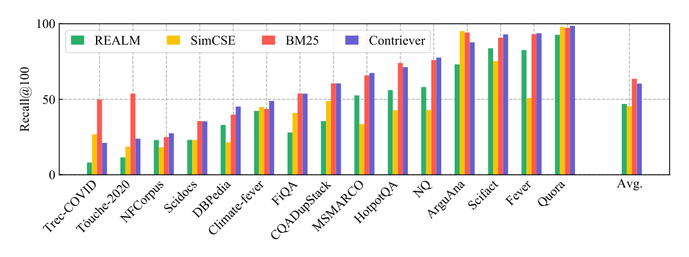
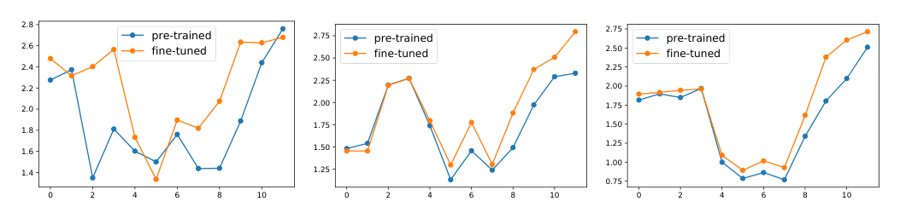
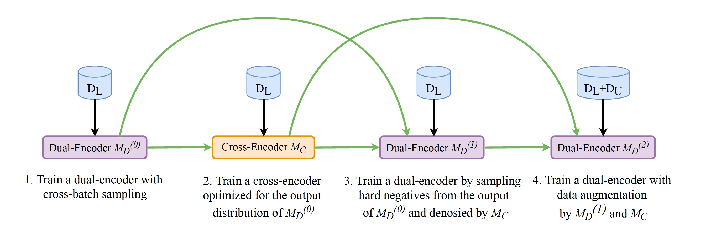

# 无监督对比检索三部曲：SimCSE / Contriever / Condenser + coCondenser

> **paper**：[SimCSE (EMNLP 2021)](https://arxiv.org/abs/2104.08821) · [Contriever (TMLR 2022)](https://arxiv.org/abs/2112.09118) · [Condenser (EMNLP 2021)](https://arxiv.org/abs/2104.08253) · [coCondenser (ACL 2022)](https://arxiv.org/abs/2108.05540)
> **code**：[princeton-nlp/SimCSE](https://github.com/princeton-nlp/SimCSE) · [facebookresearch/contriever](https://github.com/facebookresearch/contriever) · [luyug/Condenser](https://github.com/luyug/Condenser)
> **refs**：[Wang & Isola 2020 alignment/uniformity](https://arxiv.org/abs/2005.10242) · [ICT (Lee et al. 2019)](https://arxiv.org/abs/1906.00300) · [DPR (Karpukhin 2020)](https://arxiv.org/abs/2004.04906) · [MoCo (He 2020)](https://arxiv.org/abs/1911.05722) · [Funnel Transformer](https://arxiv.org/abs/2006.03236)
> **backbone**：BERT-base/large、RoBERTa-base/large、mBERT/XLM-R（Contriever 多语版）
> **date**：SimCSE 2021-04；Contriever 2021-12；Condenser 2021-04；coCondenser 2021-08
> **modality**：文本（句向量 / 段落检索）
> **languages**：以英文为主；mContriever / multilingual-SimCSE 覆盖多语
>
> 本文把 **BERT 出来「不能直接做嵌入」的病灶** 讲透：SimCSE 从**对齐-均匀**几何角度纠偏；Contriever 用**随机裁剪 + MoCo 队列**把弱监督对比推到能与 BM25 平齐；Condenser / coCondenser 从**架构 + 语料级对比预训练**给出结构性解法。这三条线共同构成后续 E5 / BGE / LLM-Embedding 的地基。

---

## 一句话定位

三篇论文都在解决同一个问题：**BERT 出来的 CLS / mean-pool 向量各向异性、无法直接用于检索**。区别在切入点：

| 论文        | 切入点                                              | 核心机制                                           |
| ----------- | --------------------------------------------------- | -------------------------------------------------- |
| SimCSE      | 微调阶段的**对齐-均匀**（Wang & Isola 2020）        | Dropout 当噪声的**无监督对比**；NLI 蕴含+矛盾监督 |
| Contriever  | 预训练+微调**共同**的无监督对比                     | 独立裁剪构造正对 + **MoCo 队列**扩负例             |
| Condenser   | 预训练**架构**不合适——CLS 中间层「休眠」          | 早/晚双分支 + Head，强迫 CLS 主动聚合信息          |
| coCondenser | Condenser + **语料级**对比预训练                    | 同文档两个 span 为正、跨文档为负；warm-up 检索空间 |

三者的关系是 **正交、可叠加**：Condenser/coCondenser 改**预训练**、SimCSE 改**微调损失**、Contriever 改**无监督对比配方**；BGE C-Pack 后来把 RetroMAE（Condenser 思想的继承）+ 弱监督对比 + 监督对比拼成一条完整流水线。

---

## 谱系与位置

```text
BERT-MLM
  ├─(改预训练架构)─→ Condenser ──→ coCondenser ──→ RetroMAE / DupMAE ──→ BGE C-Pack / BGE-M3
  ├─(改微调损失)  ─→ SimCSE (unsup + NLI) ──→ Sentence-BERT+SimCSE ──→ E5 / BGE 都在用
  └─(改无监督对比配方) ─→ Contriever ──→ mContriever ──→ E5 / GTE 的弱监督阶段
```

后续 2023–2024 主流嵌入模型几乎都在这三条线的组合上迭代：

- **E5**：弱监督对比（Contriever 血脉）+ 大规模半结构化对（CCPairs）+ 监督微调（NLI + MS-MARCO）
- **BGE C-Pack / BGE-M3**：RetroMAE 检索预训练（Condenser 血脉）+ 弱监督对比 + 监督对比 + 自蒸馏
- **LLM2Vec / gte-Qwen / QZhou-Embedding**：把 BERT 换成 Decoder LLM，但**训练配方仍是 SimCSE + Contriever + Condenser 的合成**

## Wang & Isola 的对齐-均匀几何

三篇文章的分析工具都是 Wang & Isola 2020 提出的两个度量：

$$
\ell_{\text{align}} \;\triangleq\; \mathbb{E}_{(x,x^+)\sim p_{\text{pos}}}\; \bigl\lVert f(x) - f(x^+)\bigr\rVert^2
\qquad
\ell_{\text{uniform}} \;\triangleq\; \log\; \mathbb{E}_{x,y \sim p_{\text{data}}} \; e^{-2\lVert f(x)-f(y)\rVert^2}
$$

在单位球面上，$\ell_{\text{align}}$ 越小表示同义样本越紧、$\ell_{\text{uniform}}$ 越小表示表示越均匀（各向异性越弱）。它们与 InfoNCE 的渐近极限刚好对上：

$$
-\tfrac{1}{\tau}\mathbb{E}[f(x)^\top f(x^+)] \;+\; \mathbb{E}\log \mathbb{E}[e^{f(x)^\top f(x^-)/\tau}]
$$

第一项对齐正对、第二项打散所有点。SimCSE 论文明确用这两个坐标画训练轨迹（见下文 Figure 3）；Contriever 与 Condenser 尽管没画同一张图，但结论一致：**BERT 原生表示是「对齐可以，均匀极差」，导致 cosine 相似度普遍偏高、无法在 ANN 索引里区分**。

---

## SimCSE：Dropout 当噪声 + NLI 监督

### 无监督：对同一句话两次前向，让 dropout 造两份「视图」

给定句子 $x_i$，同一 encoder 前向两次，dropout mask 分别为 $z, z'$，得到两个不同的向量 $h^{z_i}_i, h^{z'_i}_i$。它们互为正对，同 batch 其它句子为负例：

$$
\ell_i = -\log\frac{\exp\bigl(\mathrm{sim}(h^{z_i}_i, h^{z'_i}_i)/\tau\bigr)}{\sum_{j=1}^N \exp\bigl(\mathrm{sim}(h^{z_i}_i, h^{z'_j}_j)/\tau\bigr)}
$$

- $\mathrm{sim}(\cdot,\cdot)$ 用余弦相似度，$\tau=0.05$。
- 训练数据只是 **10^6 条 Wikipedia 随机句子**，不需要任何标注对。
- BERT-base 上 STS-B 从原始 pooling 的 ~60 分左右直接拉到 **82.5**（Spearman）。

这份「无监督」的关键是不再依赖离散数据增强（词删/词替换）。论文 Table 1 显示：随机 crop 20%、删词 10%、同义词替换、MLM 替换的 STS-B 都不如什么都不做只靠 dropout；一旦把 dropout 关掉（`p=0`）或者 fix 两次一样的 mask，STS-B 直接崩到 43.6。

### 为什么 dropout 有效：对齐-均匀轨迹

SimCSE 在 STS-B 上每 10 步画一次 $(\ell_{\text{align}}, \ell_{\text{uniform}})$，得到如下轨迹：


- **Fixed 0.1**（两次前向共用同一份 dropout mask）：对齐完美（$\ell_{\text{align}} \to 0$）但均匀性几乎不动 —— 相当于告诉模型「同一句就是同一句」，学不到区分性。
- **No dropout**（关掉 dropout）：与 Fixed 0.1 表现类似，representation collapse。
- **Delete one word**（随机删一个词）：均匀性有进步但同时把对齐性也搞坏了。
- **Unsup. SimCSE**：均匀性和对齐性**同时**改善，训练全程都在往左下角走。

理解方式：dropout 是**表征空间上**的最小扰动，等于给 encoder 加了一层「同一句的一致性正则」；而删词是**语义空间**上的扰动，直接把正对拉开。前者只降均匀性、不损对齐性，是无监督 InfoNCE 需要的正对生成方式。

### 有监督：NLI 蕴含当正对、矛盾当难负例

进一步引入 SNLI + MNLI 中的三元组 $(x_i, x_i^+, x_i^-)$：

- $x_i$：premise
- $x_i^+$：entailment hypothesis（正对）
- $x_i^-$：contradiction hypothesis（**难负例**）

损失变为：

$$
\ell_i = -\log \frac{e^{\mathrm{sim}(h_i, h^+_i)/\tau}}{\sum_{j=1}^N \Bigl( e^{\mathrm{sim}(h_i, h^+_j)/\tau} + e^{\mathrm{sim}(h_i, h^-_j)/\tau} \Bigr)}
$$

- **只用 entailment**：STS-B 84.9
- **加 contradiction 作难负**：STS-B **86.2**
- 加 ANLI 或再加无监督 SimCSE：**没有额外增益**（说明这批数据里矛盾对已经把「难度」堆满了）
- 双塔（$f_{\theta_1}, f_{\theta_2}$）反而掉到 84.2 —— 与后续 E5 / BGE 的「双塔共享编码器」结论一致

### 数据集与评测

| 类别             | 用途           | 规模                                            |
| ---------------- | -------------- | ----------------------------------------------- |
| Wikipedia 句子   | 无监督预训练   | 10^6 条随机采样                                 |
| SNLI + MNLI      | 监督对比       | 314k entailment 对 + 314k contradiction 对      |
| STS12-16, STS-B, SICK-R | 主评测       | 7 个语义相似度数据集，Spearman 相关系数          |
| SentEval Transfer | 迁移评测       | 7 个短句分类任务（MR / CR / SUBJ / MPQA / SST-2 / TREC / MRPC）|

**结果**：BERT-base + Unsup. SimCSE 在 7 个 STS 上均值 **76.3**（前 SOTA 72.1）；BERT-base + Sup. SimCSE **81.6**（前 SOTA 79.4）。RoBERTa-large + Sup. SimCSE 达 **83.8**，2021 年 STS 无敌手。

### 对后续工作的辐射

- **Sentence-BERT 后续版本**：把 SBERT 微调 loss 换成 SimCSE-style 对比 + NLI 三元组
- **E5 stage 2**：CCPairs 弱监督预训练之后，用 NLI + MS-MARCO 做「SimCSE-式监督对比 + hard neg」
- **LLM2Vec / QZhou-Embedding / Conan-v2**：Decoder 骨干加双向注意力后，**第三步就是 SimCSE**
- **Dropout 温度组合的经验值**：$\tau=0.05$、`hidden_dropout=0.1` 是后续绝大多数嵌入训练的默认起点

---

## Contriever：无监督随机裁剪 + MoCo 队列

Contriever 走的是另一条路：不给你标注，能不能直接把双塔 BERT 训成一个可用检索器？答案是可以，前提是**正对构造 + 负例池**两件事都做对。

### 正对：Independent Cropping 优于 ICT

给定一篇文档，Contriever 独立采样两段 span $q, k^+$，两段都是 **连续的 token 序列**，二者可以有 overlap。对比之前主流的 ICT（Inverse Cloze Task，一段小 span 作 query、其补集作 key）：

- **ICT**：query 与 key **互斥**、且 query 通常更短，一开始就把 q/d 长度分布拉开
- **Independent Cropping**：两段独立采样，**长度分布对称**、有 overlap，鼓励网络学到「近似词面命中」这一 BM25 式的能力

论文 Section 6 消融显示：Cropping > ICT，尤其在 BEIR 的词面为主的数据集（Fever、Trec-COVID）上差距明显。

此外 Contriever 还会对 query 与 key 分别 **随机删 10% 的 token**，作为额外扰动。

### 负例：In-batch → MoCo Queue

InfoNCE 对负例池大小敏感（Chen et al. 2020）。Contriever 用 MoCo 把负例池从「batch 内」扩到「跨 batch 队列」：

- 维护一个大小 $K$ 的 FIFO 队列，装着**过去若干 batch 的 key 表示**
- Query encoder $f_{\theta_q}$ 用 SGD 反向传播更新
- Key encoder $f_{\theta_k}$ 用动量 EMA 更新：

$$
\theta_k \leftarrow m\,\theta_k + (1-m)\,\theta_q
$$

其中 $m \in [0,1]$。论文取 $m=0.999$、$K=131{,}072$，等于每一步 InfoNCE 都能看到十几万个负样本，而 GPU batch 只需要几百。

### 数据与训练

| 项                | 内容                                        |
| ----------------- | ------------------------------------------- |
| 骨干              | BERT-base uncased（1.1 亿参）；共享 encoder |
| 池化              | 最后一层隐状态**平均池化**                  |
| 相似度            | dot product（未归一化）                     |
| 训练语料          | Wikipedia + CCNet，各占 batch 一半           |
| Batch size        | 1024（配 MoCo，等效负例数 ≈ 130k）           |
| 训练步数          | 500k                                         |
| 数据增强          | Independent cropping + 10% token deletion   |

### 评测：无监督首次接近 BM25 的稠密检索器



在 BEIR 15 个数据集的 **Recall@100** 上，无监督 Contriever 与 BM25 打平（少数场景 Trec-COVID、Touché-2020 输）：

- BEIR 平均 nDCG@10：Contriever 25.4，BM25 41.7 —— 排序仍不如 BM25，但 Recall@100 相当，作为**召回层**已经可用
- **微调后**（MS-MARCO fine-tune）：Contriever 平均 nDCG@10 拉到 40.7，与 TAS-B、Splade v2 同档
- **多语（mContriever）**：mMARCO + Mr.TyDi 上超过之前多语稠密检索器

### 消融的两点关键结论

1. **共享 encoder 对零样本迁移更好**：DPR-style 双编码器（q/d 独立）在 in-domain 强，但换域会显著掉；共享 encoder（Contriever / SimCSE / SBERT）在零样本 BEIR 上稳。
2. **MoCo 队列的关键是「大」，不是「新」**：MoCo 与「近期的 in-batch cache」相比，主要收益来自 **K 拉到 10^5 级别**，而不是 momentum 本身。

### 对后续工作的辐射

- **E5**：把 CCPairs 当作「Contriever-式弱监督对比」的更大数据源，正对不再靠随机裁剪而是靠半结构化配对
- **BGE-M3 / BGE C-Pack**：预训练阶段用 RetroMAE，弱监督用 100M+ 弱对 + in-batch MoCo；本质是 Contriever + Condenser 的合成
- **多语嵌入的标准起点**：几乎所有多语开源嵌入模型（mContriever、multilingual-e5、bge-m3）都用了 mContriever 的正对配方

---

## Condenser：CLS 结构性预训练

SimCSE 和 Contriever 都在动**目标函数**；Condenser 说：问题不在损失，在**架构 + 预训练配方**本身。

### 病灶：BERT 的 CLS 在中间层「休眠」

论文引 Clark et al. 2019 的注意力分析：

1. BERT 中间层里，CLS 的注意力模式与普通 token **没有本质差别**，其它 token 也基本不 attend CLS。
2. CLS 唯一「发挥作用」的时机是最后一层 —— 为了做 NSP 任务，才展开全局注意力。

结论：**CLS 大部分时间处于闲置状态**。要拿它做稠密表示，微调时得同时干两件事：一是学句义，二是把 CLS 「唤醒」为聚合器。低资源场景下，微调步数根本不够支付「唤醒 CLS」的成本 —— 这就是双塔难训的一个根因。

### 架构：早/晚 backbone + Condenser Head

Condenser 是一个把 Transformer 分成三段的架构：


- **Early backbone**（$L_e$ 层）：与 BERT 一致，输出 $[h^{\text{early}}_{\text{cls}}; h^{\text{early}}]$
- **Late backbone**（$L_l$ 层）：继续在这个基础上编码，输出 $[h^{\text{late}}_{\text{cls}}; h^{\text{late}}]$
- **Condenser Head**（$L_h$ 层）：接收一对 **[晚 CLS ; 早 token]** 的拼接，做 MLM 预测

$$
[h^{\text{cd}}_{\text{cls}}; h^{\text{cd}}] = \mathrm{Head}\bigl([h^{\text{late}}_{\text{cls}}; h^{\text{early}}]\bigr)
$$

$$
\mathcal{L}_{\text{mlm}} = \sum_{i \in \text{masked}} \mathrm{CE}\bigl(W\,h^{\text{cd}}_i, x_i\bigr)
$$

关键设计：**token 表征从 early 层短路进 Head，但 late 层的信息只能通过 late CLS 一个向量传进去**。要想 MLM 能预测被 mask 的 token，late CLS 必须把 late backbone 学到的东西「压缩」进去 —— 这是 Condenser 的名字来源，也是 CLS 被强制「一直在工作」的原因。

微调时把 Head 丢掉，剩下的 backbone 与 BERT 结构完全一致，可以**热替换 BERT 权重**。

### 冷启动技巧：约束 late 层不能崩

作者不想从零训 Condenser（算力预算不够），选择用 BERT 权重初始化 backbone、随机初始化 Head。但随机 Head 的梯度会把 backbone 权重带偏，因此额外加一份 **late 层的 MLM 约束**：

$$
\mathcal{L}^{c}_{\text{mlm}} = \sum_{i \in \text{masked}} \mathrm{CE}\bigl(W\,h^{\text{late}}_i, x_i\bigr)
$$

总损失 $\mathcal{L} = \mathcal{L}_{\text{mlm}} + \mathcal{L}^{c}_{\text{mlm}}$，投影矩阵 $W$ 共享。这让 late 层至少还能做 BERT 原来的 token 预测，不会因 Head 的乱梯度而崩坏。

### 训练与验证

- **配置**：$L_e = L_l = 6$、$L_h = 2$；BERT-base 初始化；Wikipedia + BookCorpus；4× 2080Ti 训练约 1 周
- **验证目标**：
  - 低资源场景 STS-B / Wiki Section Distinction：Condenser > 直接微调 BERT
  - MS-MARCO / NQ / TQA：Condenser + **单轮硬负** ≈ ANCE 多轮 hard neg + 蒸馏

论文 Figure 2 画了 MS-MARCO 的训练 loss 曲线：Condenser 早期 loss 就低于 BERT，且下降更快、更稳，佐证「结构就绪度更好」的说法。



上图对比 BERT / Condenser / ICT 三种初始化在 MS-MARCO 上的训练 loss。**Condenser 在起步阶段就明显低于 BERT，全程稳定下降**；ICT 起点略低但很快追平 BERT 而不能持续压低。低数据场景下 Condenser 的优势更大 —— 少量微调数据不够把 BERT 的 CLS 从「休眠」拉起来，但足够让 Condenser 微调出可用的检索器。

### 与 BERT / ICT 的注意力对比（Sec 5）

论文用「CLS 关注哪些 token」的注意力熵作定量分析：

- BERT：CLS 在 middle layer 熵很高（乱看），只在 last layer 才聚焦
- ICT 预训练后：整体注意力被推向「查询相关词」，但 CLS 依然只在 last layer 聚焦
- Condenser：**CLS 在中间层已经开始有明显的信息聚合模式** —— 与训练目标要求 CLS 一直在工作直接对应

---

## coCondenser：语料级对比 + Gradient Cache

Condenser 解决了 CLS 结构性问题，但**没解决另一件事**：CLS 之间的**内积**仍然没有语义 —— MLM 只教它「你能预测被 mask 的 token」，并没有教它「不同文档的 CLS 应互相远离」。RocketQA、DPR 等把这一步塞到「大 batch 微调」里，但对普通算力条件不友好。

coCondenser 的主张：**在预训练阶段就把语料级对比信号打进去**，微调时只需要小 batch、不需要难负例挖掘。



上图对比 RocketQA 与 coCondenser 的训练路径：RocketQA 靠**监督微调 + 大 batch + hard neg 去噪**堆性能；coCondenser 把这套复杂度前移到**无监督 corpus-aware 预训练**里，微调阶段只需要一次 hard neg + 小 batch。

### 语料级对比损失

给一个 batch 里 $n$ 篇文档 $[d_1, \dots, d_n]$，每篇独立采样两段 span：

$$
[s_{11}, s_{12}, s_{21}, s_{22}, \dots, s_{n1}, s_{n2}]
$$

正对：$(s_{i1}, s_{i2})$ 同文档；负对：其它文档所有 span。用 CLS 池化后的表示 $h^{\text{late}}_{\text{cls}}$（Condenser 输出）做 InfoNCE：

$$
\mathcal{L}_{\text{co}} = -\sum_{i=1}^n \log \frac{e^{\mathrm{sim}(h_{i1}, h_{i2})/\tau}}{\sum_{(j,k)\neq(i,1)} e^{\mathrm{sim}(h_{i1}, h_{jk})/\tau}}
$$

预训练总损失 = $\mathcal{L}_{\text{mlm}} + \mathcal{L}^{c}_{\text{mlm}} + \mathcal{L}_{\text{co}}$。

### Gradient Cache：小显存也能大 batch 对比

对比学习对 batch size 敏感，尤其 CLS 空间的 warm-up 需要 **每个 batch 上千个负例**。coCondenser 复用了 Gao et al. 2021b 的 gradient cache 技巧：

1. **无梯度前向**：先把整 batch 的所有 span forward 一遍，只算 CLS，不留计算图
2. **算对比损失并对 CLS 求梯度**：$\partial \mathcal{L}_{\text{co}} / \partial h_{\text{cls}}$
3. **分块反向**：把 batch 切成小 chunk，逐 chunk 重新 forward 并用第 2 步的 CLS 梯度做 backward，累加参数梯度

峰值显存 ≈ 一个小 chunk 的量，但每步梯度 == 大 batch 效果。用 4× 2080Ti 也能训 batch=2048 的 corpus contrastive。

### 检索效果：不再需要 RocketQA 那套复杂流水线

MS-MARCO Passage Ranking：

| 系统                               | MRR@10 | R@1000 |
| ---------------------------------- | :----: | :----: |
| BM25                               | 18.7   | 85.7   |
| DPR                                | 31.1   | 95.2   |
| ANCE                               | 33.0   | 95.9   |
| RocketQA（heavy pipeline）         | 37.0   | 97.9   |
| **coCondenser（simple fine-tune）**| **38.2** | **98.4** |

Natural Questions / TriviaQA 上同样与 RocketQA 打平，且**训练成本约为 RocketQA 的 1/5**。这份「预训练 warm-up 检索空间」的思路后来被 RetroMAE / DupMAE / BGE C-Pack 全面继承。

---

## 三篇的核心公式与数据集速览

| 论文        | 无标签数据             | 有标签数据                  | 主要评测              |
| ----------- | --------------------- | ---------------------------- | -------------------- |
| SimCSE      | 10^6 Wiki 句          | SNLI + MNLI (314k entailment + 314k contradiction) | STS12-16 / STS-B / SICK-R；SentEval 迁移 |
| Contriever  | Wikipedia + CCNet     | MS-MARCO（可选 fine-tune）    | BEIR 15 数据集；NQ / TQA 无监督 R@k     |
| Condenser   | Wiki + BookCorpus     | MS-MARCO / NQ / TQA / STS-B  | STS-B / Wiki Section；MS-MARCO / NQ / TQA |
| coCondenser | 目标语料（Wiki 或 MS-MARCO）| MS-MARCO / NQ / TQA         | MRR@10 / R@k          |

### 数据集简介

- **STS-B**（Semantic Textual Similarity Benchmark，2017）：8628 对短句 + 人工评分 0–5，Spearman 相关系数。是英文句向量事实上的验收集。
- **SNLI + MNLI**（斯坦福 + Multi-genre NLI）：570k + 433k 前提-假设-标签三元组，标签为 entailment / neutral / contradiction。词面重合率仅 39%，作为对比学习正对显著优于 QQP（60%）、ParaNMT（55%）。
- **BEIR**（Thakur et al. 2021）：18 个零样本检索数据集，覆盖 fact checking、citation、QA、法律、金融等；主指标 nDCG@10 与 Recall@100。是 Contriever 及后续所有稠密检索器的通用榜单。
- **MS-MARCO Passage**：约 880 万段落、80 万训练查询、约 400 万相关判定。检索训练与微调的默认数据。
- **NaturalQuestions / TriviaQA**（open-domain）：Wikipedia 上开放域 QA，评价 top-k 段落是否命中答案短语。

---

## 组合起来看：BGE / E5 是这三条线的合成

后续几个主流开源嵌入模型的训练流水线，用这三篇的语言可以完整拆解：

| 阶段       | E5                                     | BGE C-Pack / BGE-M3                            | LLM2Vec / gte-Qwen2 / QZhou-Embedding    |
| ---------- | -------------------------------------- | ---------------------------------------------- | ---------------------------------------- |
| 预训练     | BERT + Continue MLM                    | **RetroMAE**（Condenser 血脉）                 | Decoder LLM 加**双向注意力** + MNTP     |
| 弱监督对比 | **CCPairs**（1.3B → 270M）+ InfoNCE + in-batch neg | **100M** 弱对 + InfoNCE + in-batch / MoCo    | **无监督 SimCSE**（dropout 造正对）      |
| 监督对比   | NLI + MS-MARCO + hard neg              | 微调数据 + hard neg + **自蒸馏**              | 监督 InfoNCE + hard neg（+ 蒸馏）        |

三部曲对应到当前主流的位置：

- **Condenser / coCondenser** 的直接后代是 **RetroMAE**（把 Condenser Head 换成一个更彻底的「用 CLS 重建整段」目标）；BGE 全家桶都建在 RetroMAE 之上。
- **Contriever** 的直接后代是 **E5 CCPairs**、以及所有多语开源嵌入模型的弱监督阶段。
- **SimCSE** 的 dropout + NLI + contradiction hard-neg 组合被后续几乎所有句向量论文原封不动照抄，成为微调阶段的**默认菜单**。

### 常见错误用法

1. **不加共享 encoder**：SimCSE 明确显示双塔比单塔差 2 分；后续 BGE、E5、LLM2Vec 都保留单编码器。除非有明显的模态/语言差异，否则**默认共享**。
2. **把 dropout 关小以为「更稳」**：dropout `p=0.05` 会掉 1.4 分，`p=0`（关掉）会掉 11.4 分。Transformer 默认 0.1 就是最佳区间。
3. **把 NLI 神经三分类当嵌入 loss**：SNLI + MNLI 里的 entailment / neutral / contradiction 若拿去做 3-way 分类损失（SBERT 老配方），效果显著弱于把 entailment 当正、contradiction 当难负 —— 论文用同一批数据把 SBERT-NLI 从 78 拉到 86。
4. **无监督对比不用共享 encoder + 队列**：Contriever 消融显示，独立编码器 + 小 batch 是最差组合；共享 encoder + MoCo（或大 in-batch）才是稳定配方。
5. **只做微调不做预训练 warm-up**：Condenser 与 coCondenser 已证明，在数据不足或负例挖掘代价高时，**warm-up 检索空间**比堆微调复杂度性价比更高。这一结论到 2024–2025 的 NV-Embed、Snowflake Arctic 依然成立。

---

## 与本仓库既有报告的挂接

- 训练课表全景：见主文《[Embedding 调研报告](Embedding调研报告.md)》第 5 章「训练与数据工程」与第 3 章「三种表示范式」。
- BGE C-Pack / BGE-M3 是 Condenser + Contriever + SimCSE 的合成实现：见 [BGE-M3 三功能统一详解报告](BGE-M3三功能统一详解报告.md)。
- E5 是 CCPairs（Contriever 风格弱监督）+ NLI + MS-MARCO（SimCSE 风格监督）：见 [E5 详解](E5详解.md)。
- LLM 骨干上「Bi + MNTP + SimCSE」直接对应本三部曲的第 1、3 步：见 [LLM2Vec 详解](LLM2Vec详解.md)。
- 难负例的工业细节（假负、刷新、回归）：见 [难负例挖掘工业实践](难负例挖掘工业实践.md)。

---

*本报告基于四篇原论文（SimCSE / Contriever / Condenser / coCondenser）及其官方开源实现整理，公式与图片均取自 arXiv HTML / PDF 原文。*
